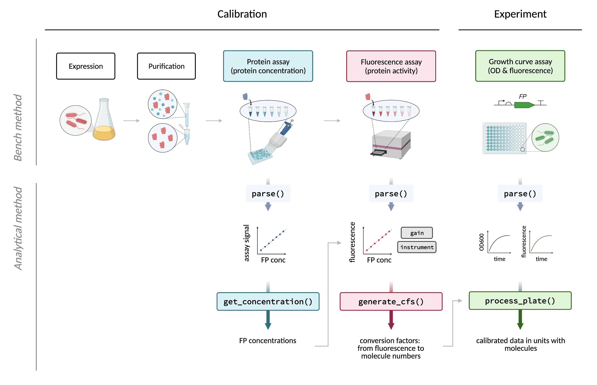

## FPCountR: Fluorescent protein calibration for plate readers

The R package **FPCountR** enables the calibration of microplate readers using fluorescent protein calibrants. This enables users to monitor cellular fluorescent protein expression in absolute units.

Background: Protein expression may be quantified by fluorescence where a fluorescent protein ('FP') is used as a reporter gene. Microplate readers allow us to quantify fluorescence in high-throughput using 96-well plates, as well as to monitor the kinetics of expression over time. It has long been noted that arbitrary units produced by such instruments prevents us from comparing experimental results between instruments, and that calibration of these instruments using standards can allow us to do so. However, existing calibrants do not allow us to express FP levels in terms of molecular or molar units, such as '100 molecules per cell', or '100 nM'. To do this, we need to use the FPs themselves as calibrants.

This method aims to describe a simple and accurate way to do just this. Our wet lab protocols are available on protocols.io (TBC) and our analysis package on GitHub (TBC). The paper accompanying these is available here (TBC).

## Overview of the package

In order to calibrate a plate reader, users will need to prepare a dilution series containing calibrants consisting of the FP that requires quantification. This FP dilution series is then used to calculate a conversion factor in 'relative fluorescence units'/molecules (RFU/molecules) by quantifying (1) the concentration of FP in each dilution, and (2) the fluorescence activity of each dilution. These assays are then processed by the functions illustrated below: the first, to extract protein concentrations from assay (1), and the second to use the concentration and fluorescence assay data to calculate the conversion factor. Finally, experimental data, such as a typical _E. coli_ assay in which synthetic gene circuits are monitored during cell growth over time, can be processed to convert units of (for example) mCherry from RFU or RFU/OD, into units of 'molecules' or 'molecules per cell' (or molar concentration).

<p align="center">
  
</p>

In practice, the reality is a bit more complicated, since there are multiple types of assay this package can handle for the protein assay (1) that have their own functions (`get_conc_bca` for the BCA assay, `get_conc_a280` for the A280 assay and `get_conc_ECmax` for the ECmax), and processed data (3) can be further processed by `calc_invivo_fppercell` for units of molecules/cell, or `calc_invivo_fpconc` for units of molar concentration. For an in-depth diagram of functions, see Supplementary Fig. 13 of the paper, or browse the description of each function after installation with `?FUNCTION_NAME`.

In addition, raw data exported from most plate readers are not immediately in the correct format for downstream data processing. Therefore, each raw data set requires 'parsing'. The `parse` designations in the figure above refer to these functions. This package comes pre-installed with parser functions for the Tecan Spark plate reader using Magellan software. 

The R functions `generate_cfs` and `process_plate` are based on functions from the [FlopR package](https://github.com/ucl-cssb/flopr), which was developed for the calibration of plate readers using **microsphere and fluorescein calibrants**. The framework that splits up the data 'tidying' and the data processing into two separate functions was also inspired by this package. For a description of the use of FlopR for the calibration of microplates using microspheres or fluorescein, see the package webpage. For a full explanation of how parser functions work, see [here](https://github.com/ucl-cssb/flopr#plate-reader-calibration).

## Installation

The package is written in R and can be installed straight from GitHub:

```r
# install.packages("devtools")
devtools::install_github("ec363/fpcountr")
```

## Examples

For a guide to getting started, see the [vignette on the FPCountR package website](https://ec363.github.io/fpcountr/articles/fpcountr.html).
