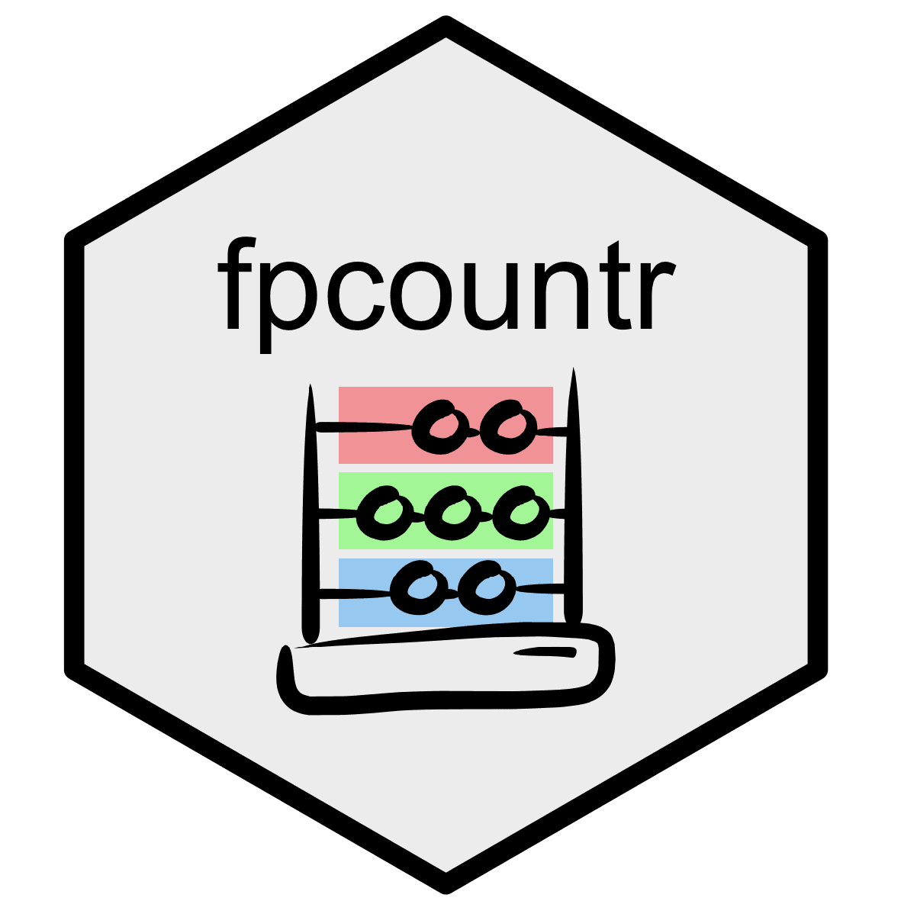

## FPCountR: Fluorescent protein calibration for plate readers 

[](https://www.nature.com/articles/s41467-022-34232-6)
[](https://doi.org/10.5281/zenodo.5760028)
[](https://www.protocols.io/view/fpcount-protocol-in-lysate-purification-free-proto-dm6gpw43plzp/v2)
[](https://ec363.github.io/fpcountr/articles/fpcountr.html)
<!--- colours: nat comms: ffffff, zenodo: 0d82c3, protocols.io ffffff, github: f6f8fa -->
[](https://www.repostatus.org/#active)

FPCountR enables the calibration of microplate readers using fluorescent protein calibrants for synthetic and molecular biology applications.

Background: Protein levels may be quantified by fluorescence where a fluorescent protein ('FP') is used as a reporter. Microplate readers enable the quantification of FP levels in high-throughput using multi-well (eg. 96-well or 384-well) plates, as well as the monitoring of FP expression kinetics over time. It has long been recognised that the arbitrary units produced by such instruments prevents the comparison of experimental results between different instruments or laboratories, and that instrument calibration is the solution. However, existing calibrants consist of small molecule fluorophores like fluorescein, and as such only allow conversion into _units of that fluorophore_ (expressed as 'molecules of equivalent fluorescein' or MEF/L), rather than units of _protein_ (eg. '100 proteins per cell', or '100 nM protein'). To do this, we need to use the FPs themselves as calibrants.

FPCountR aims to describe a simple and accurate way to generate fluorescent protein calibrants and enable the extraction of absolute protein units from plate reader experiments. The method is described in detail in our paper, 'Absolute protein quantification using fluorescence measurements with FPCountR', which is available open access at [Nature Communications](https://www.nature.com/articles/s41467-022-34232-6). The most up-to-date version of the experimental protocol can be found in Supplementary Note 5 of the paper or on [protocols.io](https://www.protocols.io/view/fpcount-protocol-in-lysate-purification-free-proto-dm6gpw43plzp/v2). The corresponding analytical software package is available on [GitHub](https://github.com/ec363/fpcountr). A complete mathematical description of the analytical workflow carried out by the software can also be found in Supplementary Note 6 of the paper.

## Overview of the package

In order to calibrate a plate reader, users need to prepare a dilution series of calibrants consisting of the FP that requires quantification. This FP dilution series is then used to calculate a conversion factor in 'relative fluorescence units'/molecules (RFU/molecules) by quantifying (1) the concentration of FP in each dilution, and (2) the fluorescence activity of each dilution. These assays are then processed by the functions illustrated below: the first, to extract protein concentrations from assay (1), and the second to use the concentration and fluorescence assay data to calculate the conversion factor. Finally, experimental data, such as a typical _E. coli_ assay in which synthetic gene circuits are monitored during cell growth over time, can be processed to convert units of (for example) mCherry from RFU or RFU/OD, into units of 'molecules' or 'molecules per cell' (or molar concentration).

<p align="center">
  
</p>

## Further details about package functions

The above is a simplified overview. This package can handle multiple types of protein assay data (1) that have their own functions (`get_conc_bca` for the BCA assay, `get_conc_a280` for the A280 assay and `get_conc_ECmax` for the ECmax), though the ECmax assay is strongly recommended. Further, processed data produced with `process_plate()` (3) should be further processed by either `calc_fppercell` (to obtain protein levels in molecules per cell), or `calc_fpconc` (to obtain protein levels in molar concentration). For an in-depth diagram of package functions, see Supplementary Fig. 15 of the paper. A complete [function reference](https://ec363.github.io/fpcountr/reference/index.html) can be found on the package website and the description of each function can be found after installation with `?function_name`.

## Parser functions

Users should note that raw data exported from most plate readers are unlikely to be in the correct format for downstream data processing. Therefore, each raw data set requires 'parsing': this includes data extraction, data cleaning, data tidying, joining the data with relevant metadata and saving in CSV format. The `parse` designations in the figure above refer to these functions. This package includes parser functions for data formats exported from a Tecan Spark plate reader running Magellan software.

## Related packages

The `generate_cfs` and `process_plate` functions are based on functions from the [FlopR package](https://github.com/ucl-cssb/flopr), which was developed for the calibration of plate readers using **microsphere and fluorescein calibrants**. The framework that splits up the data parsing and the data processing into separate functions was also inspired by this package. For a description of FlopR, see the package webpage. For a full explanation of how parser functions work, see the one written for FlopR users [here](https://github.com/ucl-cssb/flopr#plate-reader-calibration).

## Installation

The package can be installed straight from GitHub:

```r
# install.packages("devtools")
devtools::install_github("ec363/fpcountr")
```

## How to use FPCountR: a fully worked example

For a guide to getting started, including a fully worked example from installation through calibration and experiment analysis, see the [vignette on the FPCountR package website](https://ec363.github.io/fpcountr/articles/fpcountr.html).

## Citing FPCountR

If you use this package and find it helpful, we'd be grateful if you could cite both the paper and package in your manuscript.

Csibra E and Stan GB. 2022. Absolute protein quantification using fluorescence measurements with FPCountR. _Nat Commun_ 13, 6600. doi: 10.1038/s41467-022-34232-6

Csibra E. 2021. FPCountR: Fluorescent protein calibration for plate readers. R package. doi: 10.5281/zenodo.5760028 GitHub page: https://github.com/ec363/fpcountr
