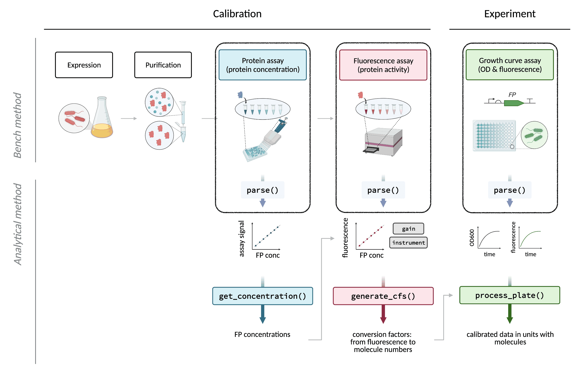
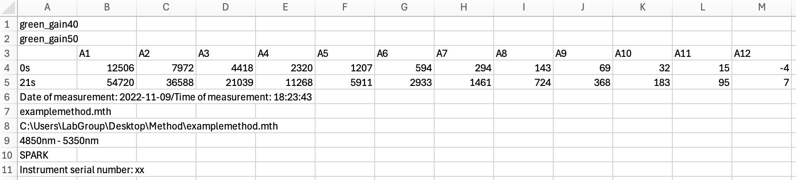
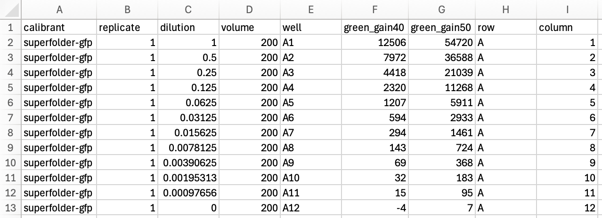
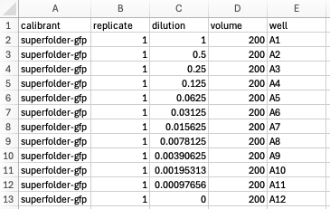

<style type="text/css">
code.r{ /* Code block */
    font-size: 11px;
}
pre { /* Code block - determines code spacing between lines */
    font-size: 13px;
}
</style>

```{r, include=FALSE}
knitr::opts_chunk$set(eval = FALSE)
knitr::opts_chunk$set(echo = TRUE)
```

The first step in any data analysis workflow is converting raw data produced by a data source (in our case, a plate reader) into a format that may be manipulated effectively for analysis. The `parse()` symbols in the overview figure below indicate that this is required for data output from each of the types of raw data analysed by this package: the spectrum data from the absorbance assay, the endpoint data from the fluorescence assay, and the endpoint/timecourse data from the experimental assay.

<p align="center">



</p>

Data parsing functions read raw data to: (1) extract data from the raw data file (removing unnecessary information), (2) tidy data into a so-called 'tidy data'\* format and (3) join data to appropriate metadata necessary for their analysis (such as information about the details of the samples in each well, the identity of the plate reader used, etc.).

\**Tidy data is of the form where every column is a variable, every row is an observation, and every cell contains a single value.*

To appreciate what parsing does to data, consider the differences between the following raw data:

<p align="center">



</p>

..and parsed data:

<p align="center">



</p>

<br>

In order to parse your data, you will need to **create a metadata** file, and **identify a parsing method** for it.

<br>

### Metadata Requirements

What do we mean by metadata and why is it necessary? Some metadata is essential for calculations, such as the ability to group samples by a variable, and take a mean or standard deviation for each level (e.g. according to which `dilution` we measured in a calibration, or the level of `inducer_concentration` that was used in an experiment). Others are required to specify axes in plots, e.g. `dilution` for calibrations or `time` for a timecourse experiment. Still others are used to verify calculations: calibration values will differ for different instruments, so `instrument` is a crucial bit of metadata for every calibration.

Metadata files should be prepared in 'tidy data' format, and may look something like this, although the exact variables will differ for each assay type.

<br>

<p align="center">



</p>

<br>

**For calibrations: absorbance spectra**

```{r, eval=TRUE, echo=FALSE, warning=FALSE}

df <- read.csv("data/vignetteparsing_meta_absspectrum.csv")

df |>
  gt::gt() |>

  # TABLE HEADER
  # header labels
  gt::cols_label(
    function_name = gt::md("**Function**"),
    metadata_variables_expected = gt::md("**Metadata Expected**"),
    required_for = gt::md("**Required For**")
  ) |>
  # header style
  gt::tab_style(
    locations = gt::cells_column_labels(),
    style = list(
      # v1
      # gt::cell_fill(color = "black"),
      # gt::cell_text(color = "white")
      # v2
      gt::cell_text(size = "small")
    )
  ) |>

  # TABLE BODY
  # font smaller
  gt::tab_style(
    locations = gt::cells_body(
      columns = tidyselect::everything()
    ),
    style = list(
      # gt::cell_text(size = 10) # fails
      gt::cell_text(size = "small")
    )
  ) |>
  # col1 bold
  gt::tab_style(
    locations = gt::cells_body(
      columns = function_name
    ),
    style = list(gt::cell_text(weight = "bold"))
  ) |>

  # cell borders
  gt::tab_style(
    locations = gt::cells_body(
      # columns = tidyselect::everything()
    ),
    style = list(
      gt::cell_borders(
        sides = c("top", "bottom"),
        color = NULL
      )
    )
  ) |>

  # width # by default as wide as it needs to be # but shrinks when font is made smaller
  gt::tab_options(table.width = gt::px(750))

```

<br>

**For calibrations: fluorescence data**

```{r, eval=TRUE, echo=FALSE, warning=FALSE}

df <- read.csv("data/vignetteparsing_meta_fluordata.csv")

df |>
  gt::gt() |>

  # TABLE HEADER
  # header labels
  gt::cols_label(
    function_name = gt::md("**Function**"),
    metadata_variables_expected = gt::md("**Metadata Expected**"),
    required_for = gt::md("**Required For**")
  ) |>
  # header style
  gt::tab_style(
    locations = gt::cells_column_labels(),
    style = list(
      # v1
      # gt::cell_fill(color = "black"),
      # gt::cell_text(color = "white")
      # v2
      gt::cell_text(size = "small")
    )
  ) |>

  # TABLE BODY
  # font smaller
  gt::tab_style(
    locations = gt::cells_body(
      columns = tidyselect::everything()
    ),
    style = list(
      # gt::cell_text(size = 10) # fails
      gt::cell_text(size = "small")
    )
  ) |>
  # col1 bold
  gt::tab_style(
    locations = gt::cells_body(
      columns = function_name
    ),
    style = list(gt::cell_text(weight = "bold"))
  ) |>

  # cell borders
  gt::tab_style(
    locations = gt::cells_body(
      # columns = tidyselect::everything()
    ),
    style = list(
      gt::cell_borders(
        sides = c("top", "bottom"),
        color = NULL
      )
    )
  ) |>

  # width # by default as wide as it needs to be # but shrinks when font is made smaller
  gt::tab_options(table.width = gt::px(750))

```

<br>

**For experimental data**

```{r, eval=TRUE, echo=FALSE, warning=FALSE}

df <- read.csv("data/vignetteparsing_meta_exptdata.csv")

df |>
  gt::gt() |>

  # TABLE HEADER
  # header labels
  gt::cols_label(
    function_name = gt::md("**Function**"),
    metadata_variables_expected = gt::md("**Metadata Expected**"),
    required_for = gt::md("**Required For**")
  ) |>
  # header style
  gt::tab_style(
    locations = gt::cells_column_labels(),
    style = list(
      # v1
      # gt::cell_fill(color = "black"),
      # gt::cell_text(color = "white")
      # v2
      gt::cell_text(size = "small")
    )
  ) |>

  # TABLE BODY
  # font smaller
  gt::tab_style(
    locations = gt::cells_body(
      columns = tidyselect::everything()
    ),
    style = list(
      # gt::cell_text(size = 10) # fails
      gt::cell_text(size = "small")
    )
  ) |>
  # col1 bold
  gt::tab_style(
    locations = gt::cells_body(
      columns = function_name
    ),
    style = list(gt::cell_text(weight = "bold"))
  ) |>

  # cell borders
  gt::tab_style(
    locations = gt::cells_body(
      # columns = tidyselect::everything()
    ),
    style = list(
      gt::cell_borders(
        sides = c("top", "bottom"),
        color = NULL
      )
    )
  ) |>

  # width # by default as wide as it needs to be # but shrinks when font is made smaller
  gt::tab_options(table.width = gt::px(750))

```

<br>

**Notes:**

-   Variables that are not required for calculations are included for the sake of reproducibility.
-   `channel_name/ex/em` refers to the fluorescence 'channel', i.e. filter set. The one most commonly used for GFPs includes excitation filter at 485nm with 20nm bandwidth and emission at 535nm with 25nm bandwidth. For this, `channel_name` may be 'green' or 'blue_ex_green_em' or anything that is concise and meaningful for your calibrations. If you are taking calibrations at several gains (as is recommended), the names given to your fluorescence measurements/readings **must** match the value in `channel_name` exactly (e.g. `channel_name` = 'green' and measurements taken are called 'green_40', 'green_50', .. 'green_120'). `channel_ex` could be "485/20".
-   `protein` is expected to equal "none" for the blank/buffer wells and to be empty for wells that were not used in the assay.
-   `dilution` should be specified as 1 for the undiluted sample, 0.5 for a 2-fold diluted sample, etc. `dilution` must be left blank for blank and buffer wells.
-   `mw_gmol1` is molecular weight in g/mol.
-   `concentration_ngul` is concentration in ng/ul.
-   `row` and `column` are also expected in every function above, but these should be auto-generated by the parser function from the metadata `well` column.
-   `time` should be auto-generated by the parser function for timecourse data.

<br>

#### Save metadata templates

For a shortcut to creating your own metadata templates, run:

```{r eval=FALSE}
save_metadata_template(
  data_type = "absspectrum", # OPTIONS: "absspectrum", "fluordata", "exptdata"
  plate_type = 96, # 96 for 96-well plate, etc
  outfolder = "templates" # where to save files
)
```

<br>

### Methods for Parsing Data

<br>

#### Using Tecan Spark plate readers

As `fpcountr` was developed in a laboratory that used Tecan Spark instruments, we have bundled functions into the package that can parse data exported from Spark plate readers. You will need different parsing functions depending on whether you are using their Magellan software or their SparkControl software.

**Magellan software parsers**

`parse_magellan()` handles standard/endpoint and timecourse/kinetic data. To parse a data file, the minimum information you need is the location of your data and metadata files, and whether/not your data is a timeseries (i.e. timecourse/kinetic data). For fluorescence data from endpoint/standard assays, such as calibrations, you might use:

```{r, eval=FALSE}
parsed_data <- parse_magellan(
  data_csv = "path/to/data.csv",
  metadata_csv = "path/to/metadata.csv",
  timeseries = FALSE
)
```

This function can work out the number of readings with no extra information, assuming that the only exported information is data, and not metadata. If the raw data export file includes lines above and below the fluorescence or absorbance data occupied by metadata such as 'Well Positions', 'Layout' or 'Replicate Info', this needs indicating with `metadata_above` (to indicate lines above the data taken up by such metadata), or `metadata_below`.

```{r, eval=FALSE}
parsed_data <- parse_magellan(
  data_csv = "path/to/data.csv",
  metadata_csv = "path/to/metadata.csv",
  timeseries = FALSE,
  metadata_above = 1,
  metadata_below = 0
)
```

Further, if you exported temperature data with the fluorescence data, causing the data to be right-shifted from the otherwise default second column, use `custom = TRUE` and specify `startcol` and `endcol`.

```{r, eval=FALSE}
parsed_data <- parse_magellan(
  data_csv = "path/to/data.csv",
  metadata_csv = "path/to/metadata.csv",
  timeseries = FALSE,
  custom = TRUE, startcol = 3, endcol = 98
)
```

If the data does not include all 96 wells expected, e.g. it is truncated at H11 instead of H12 due to export options, you can use `insert_wells_below = 1` which will add a blank line at the end of the data. This can help with matching metadata files containing entries for 96 wells with data containing fewer than 96 entries.

```{r, eval=FALSE}
parsed_data <- parse_magellan(
  data_csv = "path/to/data.csv",
  metadata_csv = "path/to/metadata.csv",
  timeseries = FALSE,
  custom = TRUE,
  startcol = 3,
  endcol = 97,
  insert_wells_above = 0,
  insert_wells_below = 1
)
```

For timecourse/kinetic assays, such as from microbial growth curve experiments, choose `timeseries = TRUE` and specify:

-   `timestart`: the text in column 1 with which to identify the first row of data. This is usually "0s".
-   `interval`: the number of minutes between any 2 readings
-   `mode`: which specifies whether an interval starts with readings ("read_first") or an incubation ("incubate_first"). This will normally be "read_first".

```{r, eval=FALSE}
parsed_data <- parse_magellan(
  data_csv = "path/to/data.csv",
  metadata_csv = "path/to/metadata.csv",
  timeseries = TRUE,
  timestart = "0s",
  interval = 10, # in minutes
  mode = "read_first", # mode can only be "read_first" or "incubate_first"
  metadata_above = 1,
  metadata_below = 0,
  custom = TRUE,
  startcol = 3,
  endcol = 97,
  insert_wells_above = 0,
  insert_wells_below = 1
)
```

A separate function, `parse_magellan_spectrum()`, should be used to parse spectrum data. It works similarly.

```{r, eval=FALSE}
parsed_data_spectrum <- parse_magellan_spectrum(
  data_csv = "path/to/data.csv",
  metadata_csv = "path/to/metadata.csv",
  wellstart = "A1", wellend = "H12"
)
```

It is worth sanity checking outputs to make sure that the data has been extracted correctly, and adjusting the customisation parameters if it isn't.

**SparkControl software parsers**

Analogous functions exist also for the SparkControl software exports. `parse_sparkcontrol()` handles standard/endpoint and timecourse/kinetic data:

```{r, eval=FALSE}
parsed_data <- parse_sparkcontrol(
  data_csv = "path/to/data.csv",
  metadata_csv = "path/to/metadata.csv",
  timeseries = FALSE
)

parsed_data <- parse_sparkcontrol(
  data_csv = "path/to/data.csv",
  metadata_csv = "path/to/metadata.csv",
  timeseries = TRUE
)
```

and `parse_sparkcontrol_spectrum()` handles spectrum data:

```{r, eval=FALSE}
parsed_data_spectrum <- parse_sparkcontrol_spectrum(
  data_csv = "path/to/data.csv",
  metadata_csv = "path/to/metadata.csv",
  wellstart = "A1", wellend = "H12"
)
```

<br>

#### Examples

<br>

```{r, eval=TRUE}
library(fpcountr)
```

**1. Absorbance spectrum data for a calibration of mTagBFP2**

Raw data:

```{r, eval=TRUE, echo=FALSE, warning=FALSE}
df <- read.csv("data/example_absorbance.csv", header = FALSE)

# table to display
# data_to_display <- df[1:24,c(1:100)]
data_to_display <- df[1:9,1:11]
data_to_display |>
  gt::gt() |>
  # TABLE HEADER
  # header style
  gt::tab_style(
    locations = gt::cells_column_labels(),
    style = list(
      gt::cell_text(size = "small"),
      gt::cell_text(weight = "bold")
    )
  ) |>
  # TABLE BODY
  # font smaller
  gt::tab_style(
    locations = gt::cells_body(
      columns = tidyselect::everything()
    ),
    style = list(
      gt::cell_text(size = "small")
    )
  ) #|>
  # TABLE SIZE
  # gt::tab_options(container.width = gt::px(800)) |> # don't specify, so it can change w window size
  # gt::tab_options(container.height = gt::px(350)) # this is approx 10 rows: the header + 9 rows
```

Code:

```{r, eval=TRUE, warning=FALSE}
parsed_data <- parse_magellan_spectrum(
  data_csv = "data/example_absorbance.csv",
  metadata_csv = "data/example_absorbance_meta.csv",
  wellstart = "A1", wellend = "B12"
)
```
Parsed data:

```{r, eval=TRUE, echo=FALSE, warning=FALSE}

# nrow(parsed_data) # 96
# ncol(parsed_data) # 813

# table to display
# data_to_display <- parsed_data[1:24,c(1:100)]
data_to_display <- parsed_data[1:12,c(1,5,8,10:19)]
data_to_display |>
  gt::gt() |>
  # TABLE HEADER
  # header style
  gt::tab_style(
    locations = gt::cells_column_labels(),
    style = list(
      gt::cell_text(size = "small"),
      gt::cell_text(weight = "bold")
    )
  ) |>
  # TABLE BODY
  # font smaller
  gt::tab_style(
    locations = gt::cells_body(
      columns = tidyselect::everything()
    ),
    style = list(
      gt::cell_text(size = "small")
    )
  ) #|>
  # TABLE SIZE
  # gt::tab_options(container.width = gt::px(800)) |> # don't specify, so it can change w window size
  # gt::tab_options(container.height = gt::px(350)) # this is approx 10 rows: the header + 9 rows
```

<br>

**2. Fluorescence data for a calibration of mTagBFP2**

Raw data:

```{r, eval=TRUE, echo=FALSE, warning=FALSE}
df <- read.csv("data/example_fluorescence.csv", header = FALSE)

# nrow(df) # 34
# ncol(df) # 97

# table to display
# data_to_display <- df[,1:25]
data_to_display <- df[1:13,1:18]
data_to_display |>
  gt::gt() |>
  # TABLE HEADER
  # header style
  gt::tab_style(
    locations = gt::cells_column_labels(),
    style = list(
      gt::cell_text(size = "small"),
      gt::cell_text(weight = "bold")
    )
  ) |>
  # TABLE BODY
  # font smaller
  gt::tab_style(
    locations = gt::cells_body(
      columns = tidyselect::everything()
    ),
    style = list(
      gt::cell_text(size = "small")
    )
  ) #|>
  # TABLE SIZE
  # gt::tab_options(container.width = gt::px(800)) |> # don't specify, so it can change w window size
  # gt::tab_options(container.height = gt::px(350)) # this is approx 10 rows: the header + 9 rows
```

Code:

```{r, eval=TRUE, warning=FALSE, message=FALSE}
parsed_data <- parse_magellan(
  data_csv = "data/example_fluorescence.csv",
  metadata_csv = "data/example_fluorescence_meta.csv",
  timeseries = FALSE,
  custom = TRUE,
  startcol = 2,
  endcol = 25,
  insert_wells_above = 0,
  insert_wells_below = 72
)
```
Parsed data:

```{r, eval=TRUE, echo=FALSE, warning=FALSE}

# nrow(parsed_data) # 96
# ncol(parsed_data) # 23

# table to display
data_to_display <- parsed_data[1:12,c(1,4:6,8,12:21)]
data_to_display |>
  gt::gt() |>
  # TABLE HEADER
  # header style
  gt::tab_style(
    locations = gt::cells_column_labels(),
    style = list(
      gt::cell_text(size = "small"),
      gt::cell_text(weight = "bold")
    )
  ) |>
  # TABLE BODY
  # font smaller
  gt::tab_style(
    locations = gt::cells_body(
      columns = tidyselect::everything()
    ),
    style = list(
      gt::cell_text(size = "small")
    )
  ) #|>
  # TABLE SIZE
  # gt::tab_options(container.width = gt::px(800)) |> # don't specify, so it can change w window size
  #gt::tab_options(container.height = gt::px(350)) # this is approx 10 rows: the header + 9 rows
```

<br>

**3. Experimental data**

Raw data:

```{r, eval=TRUE, echo=FALSE, warning=FALSE}
df <- read.csv("data/example_experiment.csv", header = FALSE)

# nrow(df) # 462
# ncol(df) # 97

# table to display
# data_to_display <- df
data_to_display <- df[1:11,1:16]
data_to_display |>
  gt::gt() |>
  # TABLE HEADER
  # header style
  gt::tab_style(
    locations = gt::cells_column_labels(),
    style = list(
      gt::cell_text(size = "small"),
      gt::cell_text(weight = "bold")
    )
  ) |>
  # TABLE BODY
  # font smaller
  gt::tab_style(
    locations = gt::cells_body(
      columns = tidyselect::everything()
    ),
    style = list(
      gt::cell_text(size = "small")
    )
  ) #|>
  # TABLE SIZE
  # gt::tab_options(container.width = gt::px(800)) |> # don't specify, so it can change w window size
  #gt::tab_options(container.height = gt::px(350)) # this is approx 10 rows: the header + 9 rows
```

Code:

```{r, eval=TRUE, echo=TRUE, warning=FALSE, message=FALSE}
parsed_data <- parse_magellan(
  data_csv = "data/example_experiment.csv",
  metadata_csv = "data/example_experiment_meta.csv",
  timeseries = TRUE,
  timestart = "0s",
  interval = 10, # minutes.
  mode = "read_first", # mode can only be "read_first" or "incubate_first"
  metadata_above = 1,
  metadata_below = 0,
  custom = TRUE,
  startcol = 3,
  endcol = 97,
  insert_wells_above = 0,
  insert_wells_below = 1
)
```
Parsed data:

```{r, eval=TRUE, echo=FALSE, warning=FALSE}

# nrow(parsed_data) # 9000
# ncol(parsed_data) # 15

# table to display
# data_to_display <- parsed_data[1:24,c(3,6:13)]
data_to_display <- parsed_data[1:12,c(1:4,6:13)]
data_to_display |>
  gt::gt() |>
  # TABLE HEADER
  # header style
  gt::tab_style(
    locations = gt::cells_column_labels(),
    style = list(
      gt::cell_text(size = "small"),
      gt::cell_text(weight = "bold")
    )
  ) |>
  # TABLE BODY
  # font smaller
  gt::tab_style(
    locations = gt::cells_body(
      columns = tidyselect::everything()
    ),
    style = list(
      gt::cell_text(size = "small")
    )
  ) #|>
  # TABLE SIZE
  # gt::tab_options(container.width = gt::px(800)) |> # don't specify, so it can change w window size
  # gt::tab_options(container.height = gt::px(350)) # this is approx 10 rows: the header + 9 rows
```

<br>

#### Using other plate readers

The above functions use clues from the Tecan Spark software's standardised data formats to extract the data from raw files correctly, and therefore will not work for data from other plate readers.

For other plate readers, we recommend two options:

**Writing your own functions**

For more advanced users or when working with a large number of similar data files, writing your own functions will be the best option to automate parsing of a large number of files. Note that:

-   the output needs to be 'tidy data'
-   `fpcountr` functions additionally expect that the metadata is joined to the left of the data, and that the `well` column of the metadata has been used to create two further columns: `row`, and `column`, which are placed to the right of the data. The resultant structure of required parsed data files are, left to right: [all metadata columns], [all data columns], 'row', 'column'.

**Using Parsley**

For users who do not have time to do this or do not need to automate parsing, our recommended route is to use Parsley. [**Parsley is a web app**](https://gbstan.shinyapps.io/parsleyapp/) **we developed to allow you to parse data of any type** into 'tidy data' format. The graphical user interface (GUI) lets you select the location of the data and all its characteristics within your raw data file using a point and click interface, and generates both a parsed data spreadsheet for you, as well as a 'parser function' file, that can be reused for parsing multiple data files. The software is free, available on the web and does not require the download of any software or the creation of any account. (However, you can [install it from Github](https://github.com/ec363/parsleyapp) and run it locally if you would like to. Running it locally speeds it up.)
