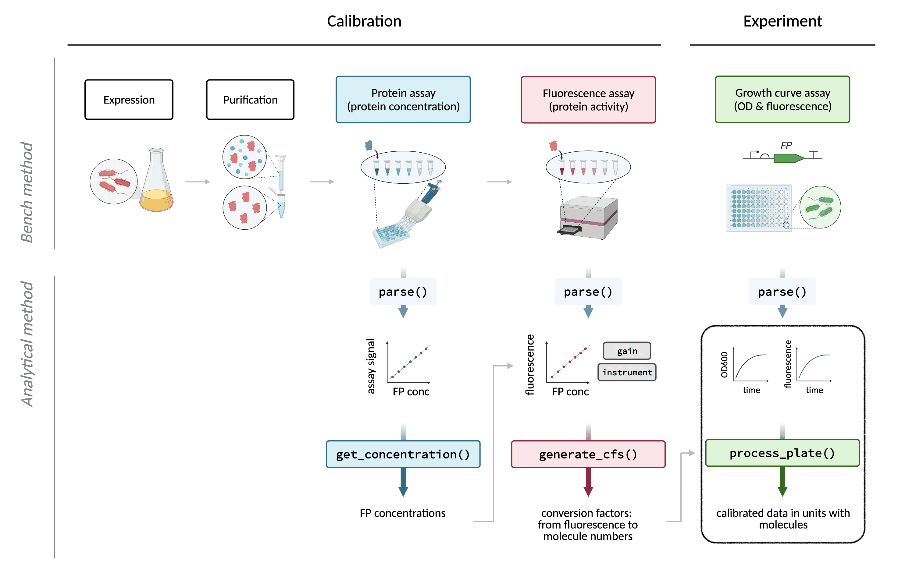
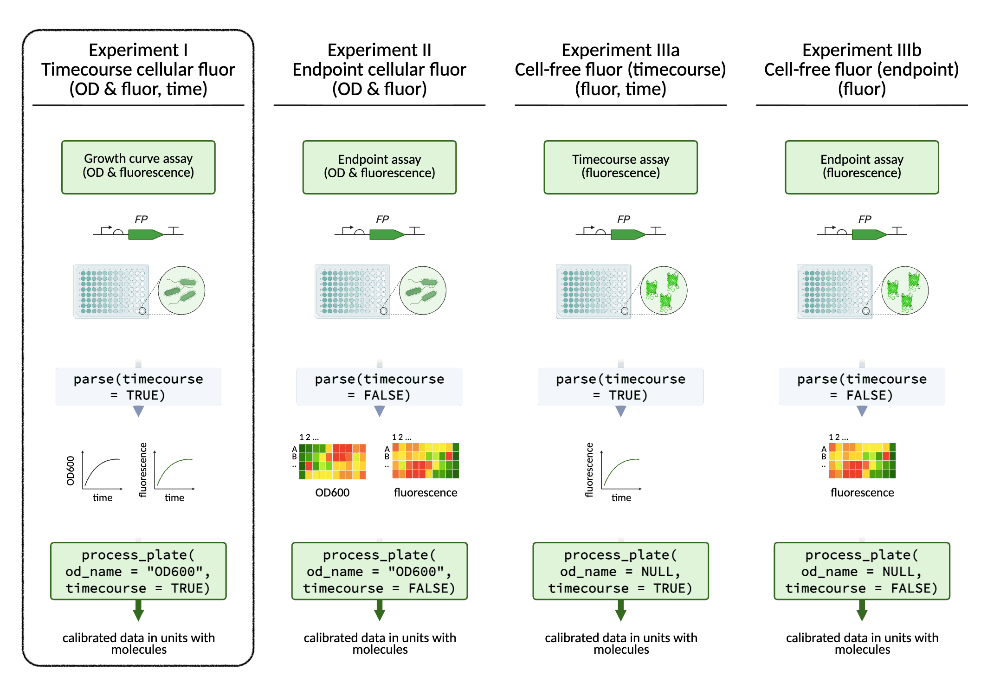

<style type="text/css">
code.r{ /* Code block */
    font-size: 11px;
}
pre { /* Code block - determines code spacing between lines */
    font-size: 13px;
}
</style>

```{r, setup, include=FALSE}
knitr::opts_chunk$set(eval = FALSE)
knitr::opts_chunk$set(echo = TRUE)
```

<p align="center">
  
</p>

FPCountR can be used to process and analyse fluorescence data of many types from any plate reader. While calibrated fluorescence measurements are recommended, calibration is optional. These 'Experiment' vignettes describe the broad types of data for which FPCountR is functional.

1. Timecourse cellular fluorescence
2. Endpoint cellular fluorescence
3. Cell-free fluorescence

---

## Timecourse cellular fluorescence

<p align="center">
  
</p>

Analysing (1) Timecourse cellular fluorescence data is covered in full in the 'Getting Started' vignette: see 'Example Code' -> 'Processing data from E. coli fluorescent protein expression experiments'.

For (2) Endpoint and (3) Cell-free data, see vignettes 'Experiment II-III'.
