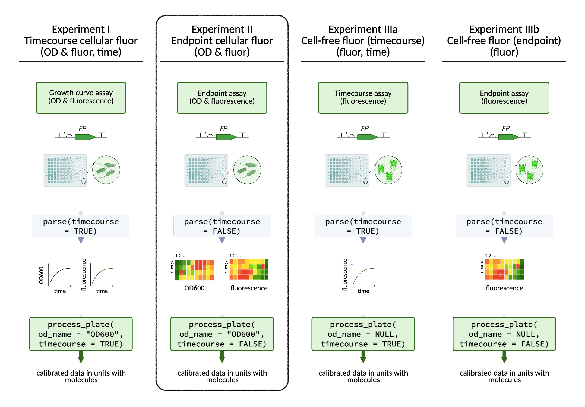
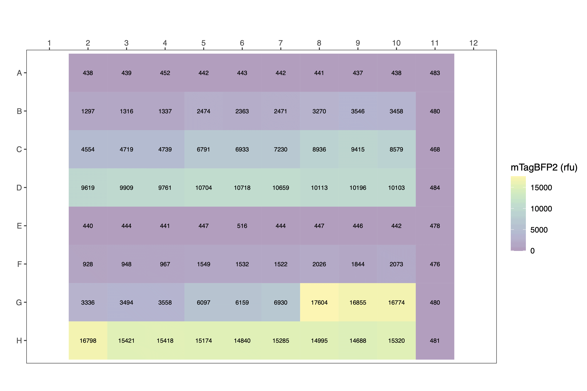
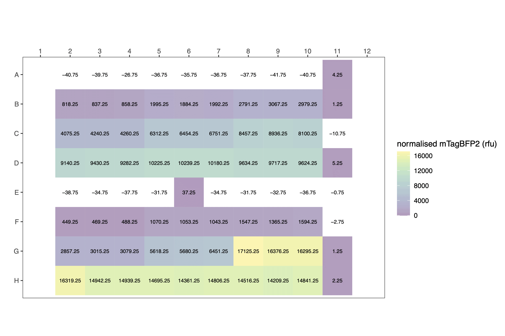
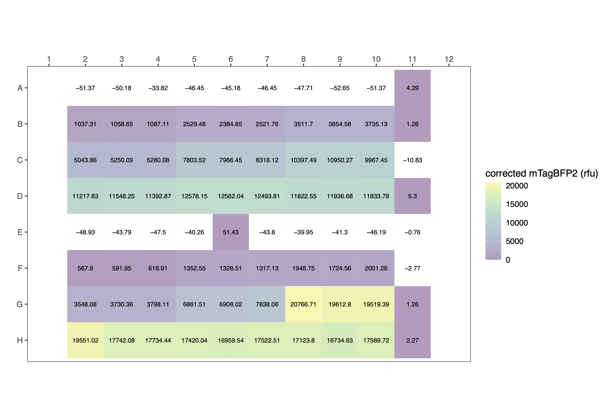
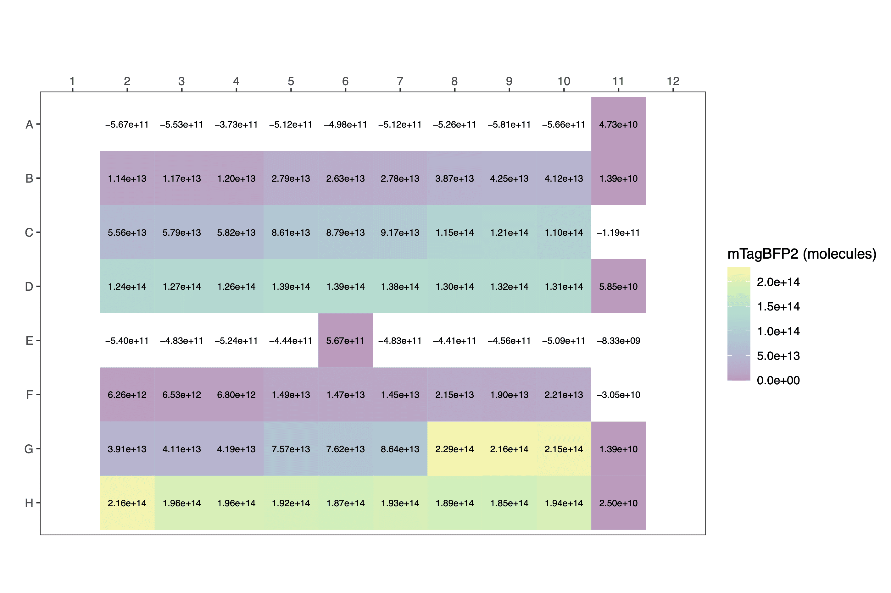
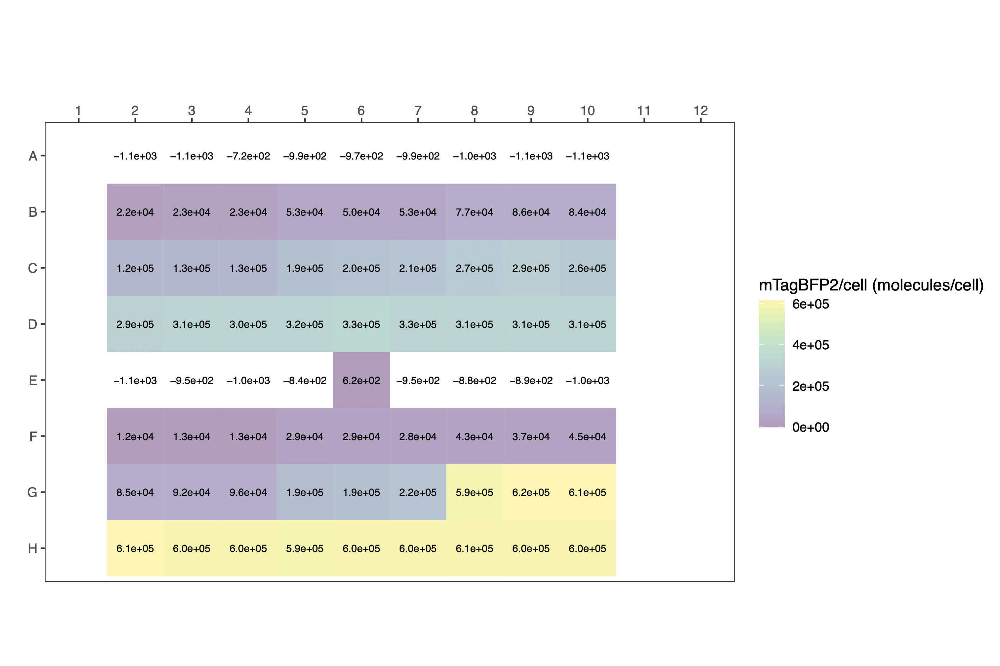

<style type="text/css">
code.r{ /* Code block */
    font-size: 11px;
}
pre { /* Code block - determines code spacing between lines */
    font-size: 13px;
}
</style>

```{r, setup, include=FALSE}
knitr::opts_chunk$set(eval = FALSE)
knitr::opts_chunk$set(echo = TRUE)
```

<p align="center">
  
</p>

In addition to timecourse data, single timepoint fluorescence data can also be processed with FPCountR, using the same functions. Just apply the argument `timecourse = FALSE`.

<br>

### Processing data from _E. coli_ fluorescent protein expression experiments - single timepoint data

```{r, eval=TRUE}
library(fpcountr)
```

#### Example for single-timepoint data

Let's consider an example in which cells expressing mTagBFP2 were grown in an incubator and transferred to the plate reader for a single timepoint scan. This data has already been parsed. With conversion factors for calibrating both mTagBFP2 fluorescence and cell number (OD) in hand, we are ready to process the experimental data.

```{r, eval=FALSE, echo=TRUE}
parsed_data <- read.csv("data/example_experiment2_parsed.csv")
parsed_data[1:24,c(3,6:10)] # view a fragment of the dataframe
```

```{r, eval=TRUE, echo=FALSE, warning=FALSE}
parsed_data <- read.csv("data/example_experiment2_parsed.csv")
data_to_display <- parsed_data[1:24,c(3,6:10)]
data_to_display |>
  gt::gt() |>
  # TABLE HEADER
  # header style
  gt::tab_style(
    locations = gt::cells_column_labels(),
    style = list(
      gt::cell_text(size = "small"),
      gt::cell_text(weight = "bold")
    )
  ) |>
  # TABLE BODY
  # font smaller
  gt::tab_style(
    locations = gt::cells_body(
      columns = tidyselect::everything()
    ),
    style = list(
      gt::cell_text(size = "small")
    )
  ) |>
  # NEW COLS
  gt::tab_style(
    locations = gt::cells_column_labels(
      # columns = c(OD600, OD700, blue, bluelow)
      columns = c(OD700, blue)
    ),
    style = list(
      gt::cell_text(color = "red")
    )
  ) |>
  gt::tab_style(
    locations = gt::cells_body(
      # columns = c(OD600, OD700, blue, bluelow)
      columns = c(OD700, blue)
    ),
    style = list(
      gt::cell_text(color = "red")
    )
  ) |>
  # TABLE SIZE
  # gt::tab_options(container.width = gt::px(800)) |> # don't specify, so it can change w window size
  gt::tab_options(container.height = gt::px(350)) # this is approx 10 rows: the header + 9 rows
```

<br>

#### Process data

Process the experimental data using `process_plate()`.

```{r, eval=FALSE}
processed_data <- process_plate(
  data_csv = "data/example_experiment2_parsed.csv",
  blank_well = c("A11", "B11", "C11", "D11", "E11", "F11", "G11", "H11"),
  
  # timecourse
  timecourse = FALSE, ### Note requirement to declare `timecourse = FALSE`
  
  # od
  od_name = "OD700",
  
  # fluorescence labels
  flu_channels = c("blue"),
  flu_channels_rename = c("blueblue"),
  
  # correction
  do_quench_correction = TRUE,
  od_type = "OD700",
  
  # calibrations
  do_calibrate = TRUE,
  instr = "spark1",
  flu_slugs = c("mTagBFP2"),
  flu_gains = c(60),
  flu_labels = c("mTagBFP2"),
  
  # conversion factors
  od_coeffs_csv = "conversion_factors/od_conversion_factors_assembled.csv",
  fluor_coeffs_csv = "conversion_factors/fp_conversion_factors_assembled.csv",
  
  # background autofluorescence subtraction
  af_model = NULL, ### Note this is a requirement for `timecourse = FALSE`
  
  outfolder = "experiment_analysis"
)
```

```{r, eval=FALSE, echo=FALSE, warning=FALSE}

# AS ABOVE BUT WITH CSV_ONLY = TRUE AND NEW OUTFOLDER
# eventually include as eval=TRUE

processed_data <- process_plate(
  data_csv = "data/example_experiment2_parsed.csv",
  blank_well = c("A11", "B11", "C11", "D11", "E11", "F11", "G11", "H11"),
  
  # timecourse
  timecourse = FALSE, ### Note requirement to declare `timecourse = FALSE`
  
  # od
  od_name = "OD700",
  
  # fluorescence labels
  flu_channels = c("blue"),
  flu_channels_rename = c("blueblue"),
  
  # correction
  do_quench_correction = TRUE,
  od_type = "OD700",
  
  # calibrations
  do_calibrate = TRUE,
  instr = "spark1",
  flu_slugs = c("mTagBFP2"),
  flu_gains = c(60),
  flu_labels = c("mTagBFP2"),
  
  # conversion factors
  od_coeffs_csv = "conversion_factors/od_conversion_factors_assembled.csv",
  fluor_coeffs_csv = "conversion_factors/fp_conversion_factors_assembled.csv",
  
  # background autofluorescence subtraction
  af_model = NULL, ### Note this is a requirement for `timecourse = FALSE`
  
  outfolder = "experiment_analysis2",
  csv_only = TRUE
)
```

The arguments are described in the 'Get Started' vignette. The output CSV is similar.

The following differences apply for `process_plate()` where `timecourse = FALSE`:

- No requirement for a column labelled `time`.
- Plots are in heatmap format, rather than line plot format.
- Autofluorescence correction cannot be carried out by any of the model options, such as `spline` or `loess`, because there isn't enough data to do this. In practice, this means the `af_model` parameter is rewritten to `NULL`, and fluorescence normalisation takes place by simply subtracting the fluorescence of the blank wells.

```{r, eval=FALSE, echo=TRUE}
processed_data[14:24,c(3,6,8,14:20)] # view a fragment of the dataframe
```

```{r, eval=TRUE, echo=FALSE, warning=FALSE}

# # v1 from chunk above
# data_to_display <- processed_data[14:24,c(3,6,8,14:20)]
# v2 from file
processed_data <- read.csv("experiment_analysis2/example_experiment2_parsed_processed.csv")
data_to_display <- processed_data[14:24,c(3,6,8,14:20)]

data_to_display |>
  gt::gt() |>
  # TABLE HEADER
  # header style
  gt::tab_style(
    locations = gt::cells_column_labels(),
    style = list(
      gt::cell_text(size = "small"),
      gt::cell_text(weight = "bold")
    )
  ) |>
  # TABLE BODY
  # font smaller
  gt::tab_style(
    locations = gt::cells_body(
      columns = tidyselect::everything()
    ),
    style = list(
      gt::cell_text(size = "small")
    )
  ) |>
  # NEW COLS
  gt::tab_style(
    locations = gt::cells_column_labels(
      columns = c(pathlength, normalised_OD_cm1, normalised_blueblue, flu_quench, corrected_normalised_blueblue, calibrated_OD, calibrated_mTagBFP2)
    ),
    style = list(
      gt::cell_text(color = "red")
    )
  ) |>
  gt::tab_style(
    locations = gt::cells_body(
      columns = c(pathlength, normalised_OD_cm1, normalised_blueblue, flu_quench, corrected_normalised_blueblue, calibrated_OD, calibrated_mTagBFP2)
    ),
    style = list(
      gt::cell_text(color = "red")
    )
  ) |>
  # TABLE SIZE
  # gt::tab_options(container.width = gt::px(800)) |> # don't specify, so it can change w window size
  gt::tab_options(container.height = gt::px(350)) # this is approx 10 rows: the header + 9 rows
```

<br>

The plot formats are heatmap styled.

Raw:
<p align="center">
  
</p>

Normalised:
<p align="center">
  
</p>

Quench corrected:
<p align="center">
  
</p>

Calibrated:
<p align="center">
  
</p>

<br>

#### Calculate per cell values

`calc_fppercell()` can be used to estimate molecules per cell.

```{r, eval=FALSE}
pc_data_mTagBFP2 <- calc_fppercell(
  data_csv = "experiment_analysis/example_experiment2_parsed_processed.csv",
  timecourse = FALSE,
  flu_channels = c("blueblue"),
  flu_labels = c("mTagBFP2"),
  remove_wells = c("A11", "B11", "C11", "D11", "E11", "F11", "G11", "H11", # media
                   "A1", "B1", "C1", "D1", "E1", "F1", "G1", "H1", 
                   "A12", "B12", "C12", "D12", "E12", "F12", "G12", "H12"), # empty wells
  get_rfu_od = FALSE,
  get_mol_cell = TRUE,
  outfolder = "experiment_analysis"
)
```

```{r, eval=FALSE, echo=FALSE}

# AS ABOVE BUT TWEAKED OUTFOLDER
# eventually include as eval=TRUE

pc_data_mTagBFP2 <- calc_fppercell(
  data_csv = "experiment_analysis2/example_experiment2_parsed_processed.csv",
  timecourse = FALSE,
  flu_channels = c("blueblue"),
  flu_labels = c("mTagBFP2"),
  remove_wells = c("A11", "B11", "C11", "D11", "E11", "F11", "G11", "H11", # media
                   "A1", "B1", "C1", "D1", "E1", "F1", "G1", "H1", 
                   "A12", "B12", "C12", "D12", "E12", "F12", "G12", "H12"), # empty wells
  get_rfu_od = FALSE,
  get_mol_cell = TRUE,
  outfolder = "experiment_analysis2"
)
```

The following differences apply for `calc_fppercell()` and `calc_fpconc()` where `timecourse = FALSE`:

- No requirement for a column labelled `time`.
- Plots are in heatmap format, rather than line plot format.

View a fragment of the dataframe to check it:

```{r, eval=FALSE, echo=TRUE}
data_to_display <- pc_data_mTagBFP2 |>
  dplyr::select(plasmid, ara_pc, OD700, calibrated_OD, blueblue, calibrated_mTagBFP2, calibratedmTagBFP2_perCell)
data_to_display[c(13:15,19:21,25:27,31:33),]
```

```{r, eval=TRUE, echo=FALSE, warning=FALSE}

# # v1 from chunk above
# data_to_display <- pc_data_mTagBFP2 |>
#   dplyr::select(plasmid, ara_pc, OD700, calibrated_OD, blueblue, calibrated_mTagBFP2, calibratedmTagBFP2_perCell)
# v2 from file
pc_data_mTagBFP2 <- read.csv("experiment_analysis2/example_experiment2_parsed_processed_percell.csv")
data_to_display <- pc_data_mTagBFP2 |>
  dplyr::select(plasmid, ara_pc, OD700, calibrated_OD, blueblue, calibrated_mTagBFP2, calibratedmTagBFP2_perCell)

data_to_display <- data_to_display[c(13:15,19:21,25:27,31:33),]
data_to_display |>
  gt::gt() |>
  # TABLE HEADER
  # header style
  gt::tab_style(
    locations = gt::cells_column_labels(),
    style = list(
      gt::cell_text(size = "small"),
      gt::cell_text(weight = "bold")
    )
  ) |>
  # TABLE BODY
  # font smaller
  gt::tab_style(
    locations = gt::cells_body(
      columns = tidyselect::everything()
    ),
    style = list(
      gt::cell_text(size = "small")
    )
  ) |>
  # NEW COLS
  gt::tab_style(
    locations = gt::cells_column_labels(
      columns = c(calibratedmTagBFP2_perCell)
    ),
    style = list(
      gt::cell_text(color = "red")
    )
  ) |>
  gt::tab_style(
    locations = gt::cells_body(
      columns = c(calibratedmTagBFP2_perCell)
    ),
    style = list(
      gt::cell_text(color = "red")
    )
  ) #|>
  # TABLE SIZE
  # gt::tab_options(container.width = gt::px(800)) |> # don't specify, so it can change w window size
  # gt::tab_options(container.height = gt::px(350)) # this is approx 10 rows: the header + 9 rows
```

Again, output plots are heatmaps.

<p align="center">
  
</p>

The data can be plotted downstream as a bar chart or similar.

```{r, eval=TRUE, echo=FALSE, warning=FALSE, message=FALSE}

data_to_plot <- pc_data_mTagBFP2 |>
  
  # tidy
  dplyr::select(plasmid, ara_pc, OD700, calibrated_OD, blueblue, calibrated_mTagBFP2, calibratedmTagBFP2_perCell) |>
  dplyr::filter(plasmid != "pS361" & plasmid != "pS381") |> # remove neg controls
  dplyr::filter(ara_pc != 0) |> # remove uninduced
  dplyr::mutate(vector = ifelse(grepl("pS361", plasmid), "p15A", "colE1")) |>
  
  # means
  dplyr::group_by(plasmid, ara_pc) |>
  dplyr::mutate(mean_cells = mean(calibrated_OD, na.rm = TRUE)) |>
  dplyr::mutate(sd_cells = sd(calibrated_OD, na.rm = TRUE)) |>
  dplyr::mutate(mean_totalBFP = mean(calibrated_mTagBFP2, na.rm = TRUE)) |>
  dplyr::mutate(sd_totalBFP = sd(calibrated_mTagBFP2, na.rm = TRUE)) |>
  dplyr::mutate(mean_percellBFP = mean(calibratedmTagBFP2_perCell, na.rm = TRUE)) |>
  dplyr::mutate(sd_percellBFP = sd(calibratedmTagBFP2_perCell, na.rm = TRUE)) |>
  
  dplyr::ungroup()
# factors
data_to_plot$vector <- factor(data_to_plot$vector, levels = c("p15A", "colE1"))

# line
plot1 <- ggplot2::ggplot() +
  # mean line
  ggplot2::geom_smooth(data = data_to_plot,
                       ggplot2::aes(x = as.numeric(ara_pc), y = mean_cells, colour = vector),
                       # colour = "#F5CD75", 
                       alpha = 0.2) +
  # sd
  ggplot2::geom_errorbar(data = data_to_plot,
                         ggplot2::aes(x = as.numeric(ara_pc), y = mean_cells,
                                      ymin = mean_cells-sd_cells,
                                      ymax = mean_cells+sd_cells),
                         width = 0.1, colour = "grey70") +
  # data
  ggplot2::geom_point(data = data_to_plot,
                      ggplot2::aes(x = as.numeric(ara_pc), y = calibrated_OD),
                      size = 0.5) +
  # mean
  ggplot2::geom_point(data = data_to_plot,
                      ggplot2::aes(x = as.numeric(ara_pc), y = mean_cells),
                      shape = 5, size = 2) +
  ggplot2::scale_x_log10("arabinose (%)") +
  ggplot2::scale_y_continuous("cell number", limits = c(0,6e8), breaks = c(0,2e8,4e8,6e8)) +
  ggplot2::scale_color_brewer(palette = "Dark2") +
  ggplot2::theme_bw(base_size = 16) +
  ggplot2::theme(
    aspect.ratio = 0.7,
    panel.grid = ggplot2::element_blank(),
    strip.background = ggplot2::element_blank(),
    strip.text = ggplot2::element_text(face = "bold", hjust = 0)
  )
plot1

# line bfp
plot2 <- ggplot2::ggplot() +
  # mean line
  ggplot2::geom_smooth(data = data_to_plot,
                       ggplot2::aes(x = as.numeric(ara_pc), y = mean_percellBFP, colour = vector),
                       # colour = "#7EB9FC", 
                       alpha = 0.2) +
  # sd
  ggplot2::geom_errorbar(data = data_to_plot,
                         ggplot2::aes(x = as.numeric(ara_pc), y = mean_percellBFP,
                                      ymin = mean_percellBFP-sd_percellBFP,
                                      ymax = mean_percellBFP+sd_percellBFP),
                         width = 0.1, colour = "grey70") +
  # data
  ggplot2::geom_point(data = data_to_plot,
                      ggplot2::aes(x = as.numeric(ara_pc), y = calibratedmTagBFP2_perCell),
                      size = 0.5) +
  # mean
  ggplot2::geom_point(data = data_to_plot,
                      ggplot2::aes(x = as.numeric(ara_pc), y = mean_percellBFP),
                      shape = 5, size = 2) +
  ggplot2::scale_x_log10("arabinose (%)") +
  ggplot2::scale_y_continuous("mTagBFP2 per cell", limits = c(NA,NA)) +
  ggplot2::scale_color_brewer(palette = "Dark2") +
  ggplot2::theme_bw(base_size = 16) +
  ggplot2::theme(
    aspect.ratio = 0.7,
    panel.grid = ggplot2::element_blank(),
    strip.background = ggplot2::element_blank(),
    strip.text = ggplot2::element_text(face = "bold", hjust = 0)
  )
plot2


```
