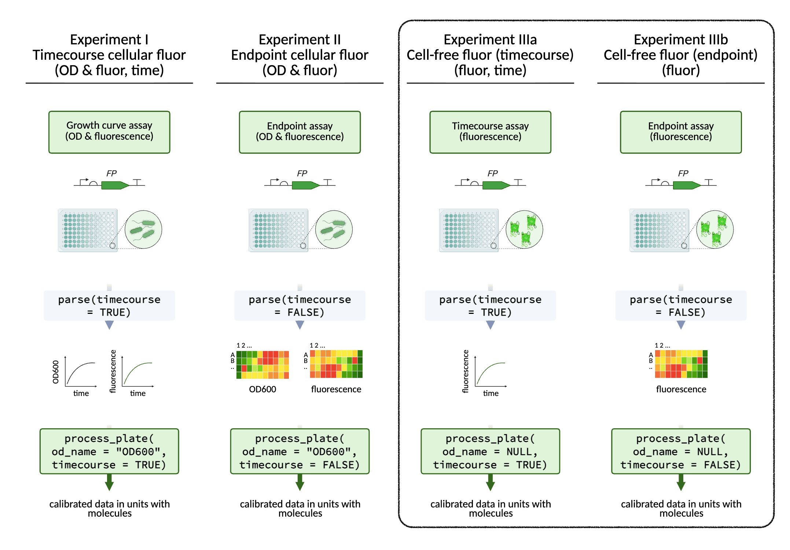
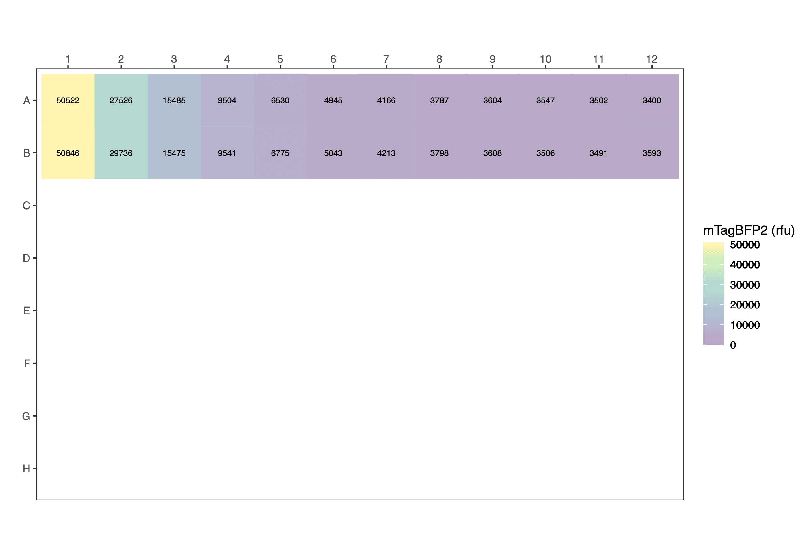
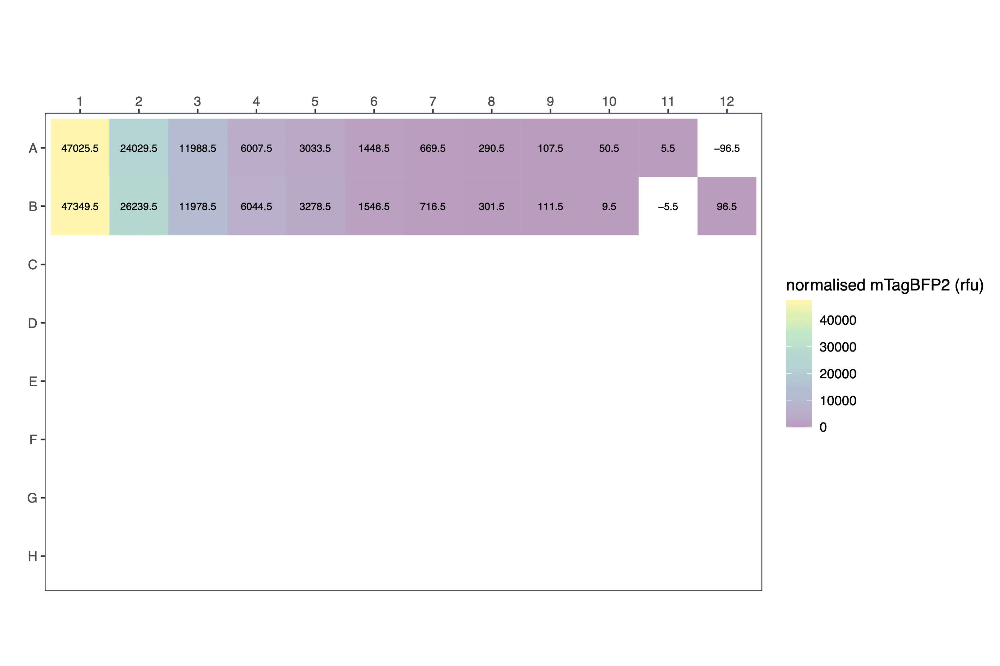
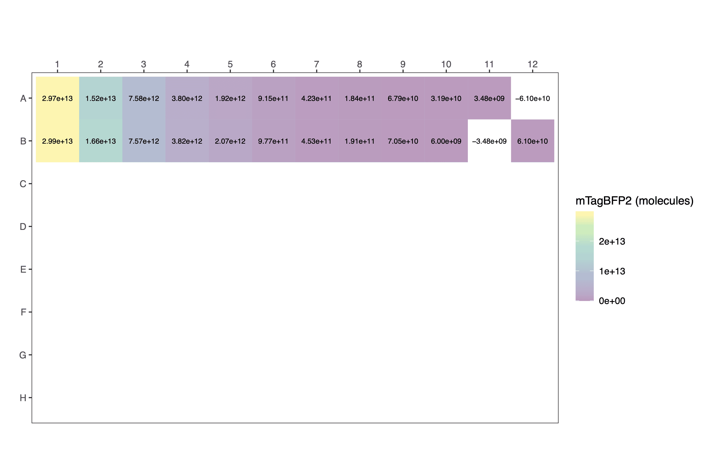

<style type="text/css">
code.r{ /* Code block */
    font-size: 11px;
}
pre { /* Code block - determines code spacing between lines */
    font-size: 13px;
}
</style>

```{r, setup, include=FALSE}
knitr::opts_chunk$set(eval = FALSE)
knitr::opts_chunk$set(echo = TRUE)
```

<p align="center">
  
</p>

In addition to cellular fluorescence data, cell-free fluorescence data can also be processed with FPCountR, using the same functions. Just apply the argument `od_name = NULL`.

<br>

### Processing data from cell-free fluorescent protein experiments

```{r, eval=TRUE}
library(fpcountr)
```

#### Example for cell-free data

Let's consider an example in which cell-free fluorescence was measured _in vitro_. For this we will use a dilution series of mTagBFP2, which was done with purified protein. This data has already been parsed. With conversion factors for calibrating mTagBFP2 fluorescence in hand, we are ready to process the experimental data.

```{r, eval=FALSE, echo=TRUE}
parsed_data <- read.csv("data/example_fluorescence_simple_parsed.csv")
parsed_data[1:24,] # view a fragment of the dataframe
```

```{r, eval=TRUE, echo=FALSE, warning=FALSE}
parsed_data <- read.csv("data/example_fluorescence_simple_parsed.csv")
data_to_display <- parsed_data[1:24,]
data_to_display |>
  gt::gt() |>
  # TABLE HEADER
  # header style
  gt::tab_style(
    locations = gt::cells_column_labels(),
    style = list(
      gt::cell_text(size = "small"),
      gt::cell_text(weight = "bold")
    )
  ) |>
  # TABLE BODY
  # font smaller
  gt::tab_style(
    locations = gt::cells_body(
      columns = tidyselect::everything()
    ),
    style = list(
      gt::cell_text(size = "small")
    )
  ) |>
  # NEW COLS
  gt::tab_style(
    locations = gt::cells_column_labels(
      # columns = c(OD600, OD700, blue, bluelow)
      # columns = c(OD700, blue)
      columns = c(blueblue090)
    ),
    style = list(
      gt::cell_text(color = "red")
    )
  ) |>
  gt::tab_style(
    locations = gt::cells_body(
      # columns = c(OD600, OD700, blue, bluelow)
      # columns = c(OD700, blue)
      columns = c(blueblue090)
    ),
    style = list(
      gt::cell_text(color = "red")
    )
  ) |>
  # TABLE SIZE
  # gt::tab_options(container.width = gt::px(800)) |> # don't specify, so it can change w window size
  gt::tab_options(container.height = gt::px(350)) # this is approx 10 rows: the header + 9 rows
```

<br>

#### Process data

Process the experimental data using `process_plate()`.

```{r, eval=FALSE}
processed_data <- process_plate(
  data_csv = "data/example_fluorescence_simple_parsed.csv",
  blank_well = c("A12", "B12"),
  
  # timecourse
  timecourse = FALSE, ### Note requirement to declare `timecourse = FALSE`
  
  # od
  od_name = NULL, ### Note requirement to declare `od_name = NULL`
  
  # fluorescence labels
  flu_channels = c("blueblue090"),
  flu_channels_rename = c("blueblue"),
  
  # correction
  do_quench_correction = FALSE, ### Note that quench correction corrects for cells masking fluorescent signal and is not required
  
  # calibrations
  do_calibrate = TRUE,
  instr = "spark1",
  flu_slugs = c("mTagBFP2"),
  flu_gains = c(90),
  flu_labels = c("mTagBFP2"),
  
  # conversion factors
  od_coeffs_csv = "conversion_factors/od_conversion_factors_assembled.csv",
  fluor_coeffs_csv = "conversion_factors/fp_conversion_factors_assembled.csv",
  
  # background autofluorescence subtraction
  af_model = NULL, ### Note this is a requirement for `timecourse = FALSE`
  
  outfolder = "experiment_analysis"
)
```

```{r, eval=FALSE, echo=FALSE, warning=FALSE}

# AS ABOVE BUT WITH CSV_ONLY = TRUE AND NEW OUTFOLDER
# eventually include as eval=TRUE

processed_data <- process_plate(
  data_csv = "data/example_fluorescence_simple_parsed.csv",
  blank_well = c("A12", "B12"),
  
  # timecourse
  timecourse = FALSE, ### Note requirement to declare `timecourse = FALSE`
  
  # od
  od_name = NULL, ### Note requirement to declare `od_name = NULL`
  
  # fluorescence labels
  flu_channels = c("blueblue090"),
  flu_channels_rename = c("blueblue"),
  
  # correction
  do_quench_correction = FALSE, ### Note that quench correction corrects for cells masking fluorescent signal and is not required
  
  # calibrations
  do_calibrate = TRUE,
  instr = "spark1",
  flu_slugs = c("mTagBFP2"),
  flu_gains = c(90),
  flu_labels = c("mTagBFP2"),
  
  # conversion factors
  od_coeffs_csv = "conversion_factors/od_conversion_factors_assembled.csv",
  fluor_coeffs_csv = "conversion_factors/fp_conversion_factors_assembled.csv",
  
  # background autofluorescence subtraction
  af_model = NULL, ### Note this is a requirement for `timecourse = FALSE` and `od_name = NULL`
  
  outfolder = "experiment_analysis3",
  csv_only = TRUE
)
```

The arguments are described in the 'Get Started' vignette. The output CSV is similar.

The following differences apply for `process_plate()` where `od_name = NULL`:

- No requirement for a column labelled `OD600`, `OD700` or similar.
- Plots for OD and cell number are not produced.
- Autofluorescence correction does not apply, as autofluorescence is a properly of cells.
- Quench correction does not apply, as this corrects for cellular interference with fluorescence signals.

```{r, eval=FALSE, echo=TRUE}
processed_data[1:12,c(1,4,5,6,9,10)] # view a fragment of the dataframe
```

```{r, eval=TRUE, echo=FALSE, warning=FALSE}

# # v1 from chunk above
# data_to_display <- processed_data[1:12,c(1,4,5,6,9,10)]
# v2 from file
processed_data <- read.csv("experiment_analysis3/example_fluorescence_simple_parsed_processed.csv")
data_to_display <- processed_data[1:12,c(1,4,5,6,9,10)]
data_to_display |>
  gt::gt() |>
  # TABLE HEADER
  # header style
  gt::tab_style(
    locations = gt::cells_column_labels(),
    style = list(
      gt::cell_text(size = "small"),
      gt::cell_text(weight = "bold")
    )
  ) |>
  # TABLE BODY
  # font smaller
  gt::tab_style(
    locations = gt::cells_body(
      columns = tidyselect::everything()
    ),
    style = list(
      gt::cell_text(size = "small")
    )
  ) |>
  # NEW COLS
  gt::tab_style(
    locations = gt::cells_column_labels(
      # columns = c(pathlength, normalised_OD_cm1, normalised_blueblue, flu_quench, corrected_normalised_blueblue, calibrated_OD, calibrated_mTagBFP2)
      columns = c(normalised_blueblue, calibrated_mTagBFP2)
    ),
    style = list(
      gt::cell_text(color = "red")
    )
  ) |>
  gt::tab_style(
    locations = gt::cells_body(
      # columns = c(pathlength, normalised_OD_cm1, normalised_blueblue, flu_quench, corrected_normalised_blueblue, calibrated_OD, calibrated_mTagBFP2)
      columns = c(normalised_blueblue, calibrated_mTagBFP2)
    ),
    style = list(
      gt::cell_text(color = "red")
    )
  ) |>
  # TABLE SIZE
  # gt::tab_options(container.width = gt::px(800)) |> # don't specify, so it can change w window size
  gt::tab_options(container.height = gt::px(350)) # this is approx 10 rows: the header + 9 rows
```

<br>

Output plot formats depend on whether the data is endpoint or timecourse/kinetic data.

Raw:
<p align="center">
  
</p>

Normalised:
<p align="center">
  
</p>

Calibrated:
<p align="center">
  
</p>

<br>

The data can be plotted downstream as a scatter plot or similar.

```{r, eval=TRUE, echo=FALSE, warning=FALSE, message=FALSE}

data_to_plot <- processed_data |>
  
  # tidy
  dplyr::select(protein, replicate, dilution, calibrated_mTagBFP2) |>
  dplyr::filter(!is.na(dilution)) |> # remove empty rows
  dplyr::filter(dilution > 0.002) |> # remove empty rows
  
  # means
  dplyr::group_by(dilution) |>
  dplyr::mutate(mean_totalBFP = mean(calibrated_mTagBFP2, na.rm = TRUE)) |>
  dplyr::mutate(sd_totalBFP = sd(calibrated_mTagBFP2, na.rm = TRUE)) |>
  dplyr::ungroup()

# linear
plot1 <- ggplot2::ggplot() +
  # sd
  ggplot2::geom_errorbar(data = data_to_plot,
                         ggplot2::aes(x = as.numeric(dilution), y = mean_totalBFP,
                                      ymin = mean_totalBFP-sd_totalBFP,
                                      ymax = mean_totalBFP+sd_totalBFP),
                         width = 0.03, colour = "grey70") +
  # data
  ggplot2::geom_point(data = data_to_plot,
                      ggplot2::aes(x = as.numeric(dilution), y = calibrated_mTagBFP2),
                      size = 1) +
  # mean
  ggplot2::geom_point(data = data_to_plot,
                      ggplot2::aes(x = as.numeric(dilution), y = mean_totalBFP),
                      shape = 5, size = 3) +
  # ggplot2::geom_line(data = data_to_plot,
  #                    ggplot2::aes(x = as.numeric(dilution), y = mean_totalBFP)) +
  
  ggplot2::scale_x_continuous("dilution") +
  # ggplot2::scale_x_log10("dilution") +
  ggplot2::scale_y_continuous("mTagBFP2 (molecules)") +
  # ggplot2::scale_y_log10("mTagBFP2 (molecules)") +
  # ggplot2::scale_color_brewer(palette = "Dark2") +
  ggplot2::theme_bw(base_size = 16) +
  ggplot2::theme(
    aspect.ratio = 1,
    panel.grid = ggplot2::element_blank(),
    strip.background = ggplot2::element_blank(),
    strip.text = ggplot2::element_text(face = "bold", hjust = 0)
  )
plot1
```
