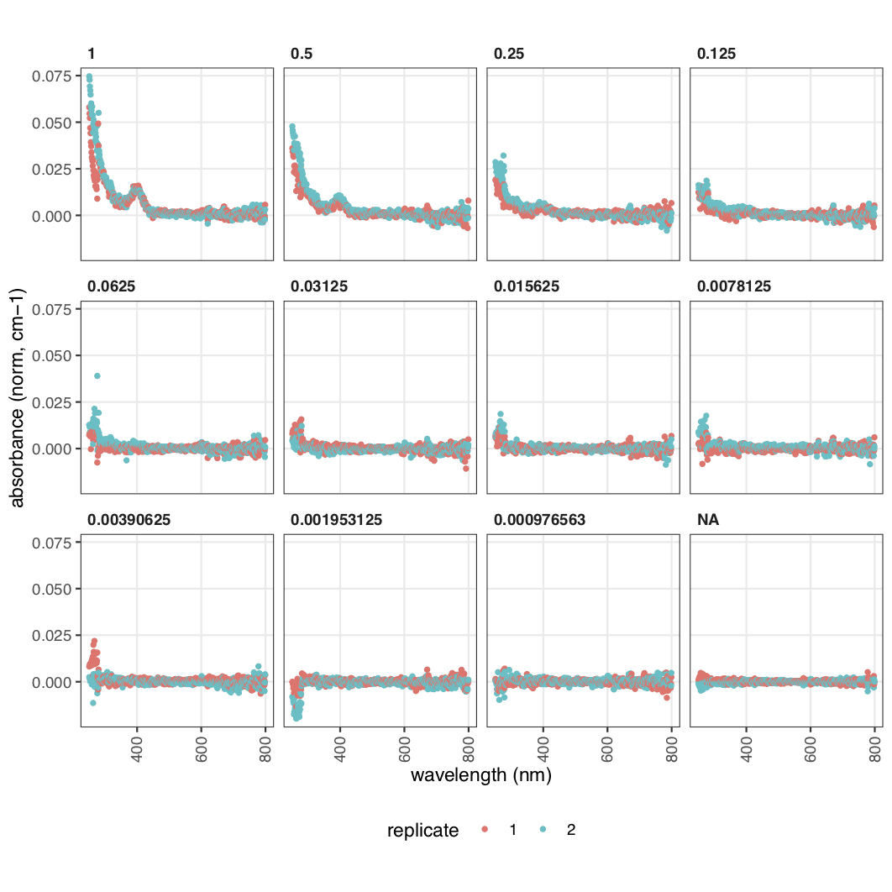
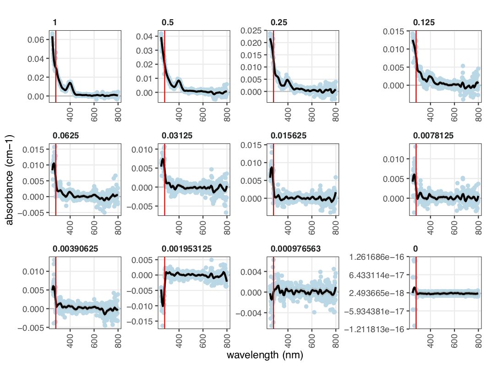
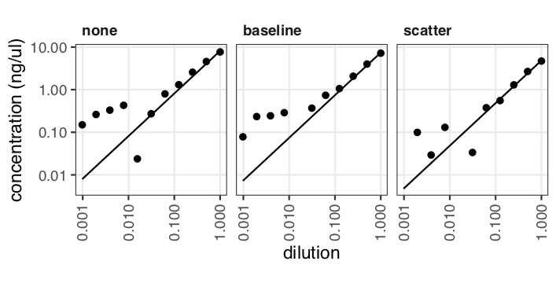
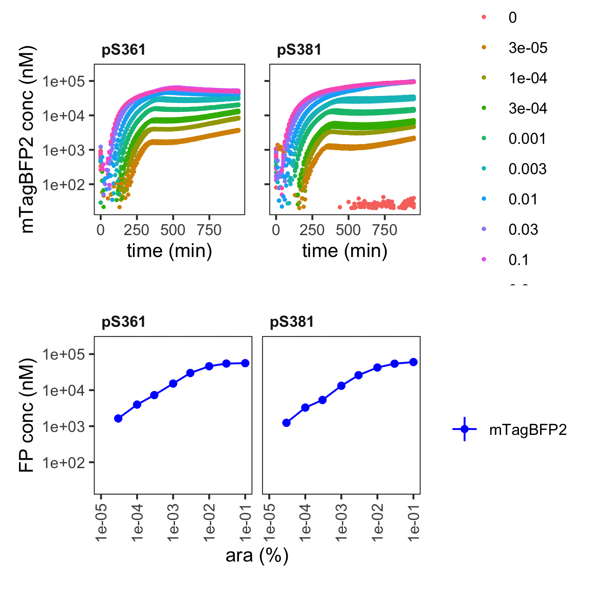

```{r setup, include=FALSE}
knitr::opts_chunk$set(echo = TRUE)
knitr::opts_chunk$set(eval = FALSE)
```

## Installation

The package is written in R and can be installed straight from GitHub:

```{r eval = FALSE}
# install.packages("devtools")
devtools::install_github("ec363/fpcountr")
```

## Example data

The package comes with example data to get you started. To find the data folder, use:

```{r eval=FALSE}
system.file("extdata", "", package = "fpcountr", mustWork = TRUE)
```

This will give you the location of the files. 

Create a new folder for this worked example (e.g. called fpcountr_example) and copy all of the files into a subfolder called data. So your data should be under fpcountr_example/data. Next, open RStudio, start a new R session and navigate to the fpcountr_example folder.

## Worked example

Load all relevant libraries.

```{r warning=FALSE, message=FALSE}
library(fpcountr)
library(magrittr)
library(rlang)
```

### Protein concentration determination with the ECmax assay

Identify the relevant files for this assay:

```{r}
data_folder <- "data"
raw_data_spectrum <- "absorbance_scan" # without .csv
data_layout_spectrum <- "absorbance_scan_layout.csv" # with csv
```

#### 1. Parse spectrum data

```{r warning=FALSE}
parsed_data_spectrum <- magellan_spectrum_parse(data_csv = file.path(data_folder, paste0(raw_data_spectrum, ".csv")),
                                                layout_csv = file.path(data_folder, data_layout_spectrum),
                                                wellstart = "A1", wellend = "H12")
parsed_data_spectrum[1:5,1:20] # check parsed absorbance spectrum looks good
```

#### 2. Process spectrum data

**Buffer and path length**

For absorbance data, path lengths require calculation. This can be done in 3 ways:

1) calculation using the 900-1000nm region for each well (use `pl_method = "calc_each"`), 
2) calculation using the 900-1000nm region for the blanks, which is used for all wells (use `pl_method = "calc_blanks"`), 
3) by using previously obtained relationship of volume:path length using water (use `pl_method = "volume"`).

For the first two, the buffer and temperature needs to be specified. `view_kfactors()` allows the inspection of possible buffer types.

- The specified 'buffer_used' needs to match one of the buffers listed in this table. (The example data was carried out with T5N15_pi buffer, this is most closely represented by "TBS" (Tris-buffered saline).)
- The number specified for 'concentration_used' needs to match the units in those tables. (Example: 0.005 M)
- The number specified for 'temperature_used' does *not* need to match those in the temperature table. (Example: 30)

For the third, make sure the `absorbance_scan_layout.csv` file contains a completed volume column (in ul).

**Provide mTagBFP2 protein sequence**

For the example data, the protein sequences are available from within the package in the `protein_seq_data` dataset.

For other FPs, protein sequences in 1-letter code need to be provided for the following functions (to allow function to work out the molecular weight).

```{r}
protein_seq <- fpcountr::protein_seq_data %>%
  dplyr::filter(slug == "mtagbfp2") %>%
  dplyr::select(sequence) %>%
  as.character()
protein_seq
```

**Process spectra**

```{r warning=FALSE}

dir.create("protquant") # Create folder for get_concentration functions' output files

# Process spectra (correct for for path length and normalise to blanks)
processed_data_spectrum_t5n15pi <- plot_absorbance_spectrum(
  spectrum_csv = file.path(data_folder, paste0(raw_data_spectrum, "_parsed.csv")),
  subset_rows = TRUE, rows_to_keep = c("G","H"), columns_to_keep = c(1:12),
  xrange = c(250,1000),
  
  # for path length
  pl_method = "calc_blanks", # options: "calc_each", "calc_blanks", "volume"
  buffer_used = "TBS", concentration_used = 0.005, temperature_used = 30,
  
  outfolder = file.path("protquant/ECmax_T5N15pi"))
processed_data_spectrum_t5n15pi
```

<p align="center">
  
</p>

#### 3. Get concentration using ECmax assay

```{r warning=FALSE}
# Use maximum absorbance wavelength (ECmax) of processed spectra to calculate protein concentrations
buffer_name <- "T5N15_pi"
proteinconcs_ecmax_t5n15pi <- get_conc_ECmax(protein_slug = "mtagbfp2", 
                                             protein_seq = protein_seq,
                                             processed_spectrum_csv = file.path("protquant/ECmax_T5N15pi", paste0(raw_data_spectrum, "_parsed_processed.csv")), # processed data
                                             # wells_to_remove = c(),
                                             corr_method = "scatter",
                                             wav_to_use1 = 500, wav_to_use2 = 315,
                                             outfolder = file.path("protquant/ECmax_T5N15pi/concentration_from_ecmax"),
                                             filename = "fp_properties_fpbase.csv" # what to name FPbase file
)
proteinconcs_ecmax_t5n15pi[1:12,] # example data should give 4.8 ng/ul for the top concentration
```

<p align="center">
  
</p>

<p align="center">
  
</p>

### Conversion factor calculation

Identify the relevant files for this assay:

```{r warning=FALSE}
# data_folder <- "data"
raw_data_fluor <- "fluorescence_data" # without .csv
data_layout_fluor1 <- "fluorescence_data_layout.csv" # with csv
dir.create("conversion_factors")
```

Assemble the data layout file from the provided data layout file and the concentrations obtained from the ECmax assay above.

```{r message=FALSE}
# 0. Assemble Data Layout final: join protein concentration data to fluorescence_data_layout.csv
# data_layout_fluor1 # contains minimal info on all wells
data_layout_fluor2 <- "protquant/ECmax_T5N15pi/concentration_from_ecmax/protein_concs_ecmax.csv" # contains concentrations from ECmax assay
# Join
data_layout_fluor1_DF <- read.csv(file = file.path(data_folder, data_layout_fluor1))
data_layout_fluor2_DF <- read.csv(file = file.path(data_layout_fluor2))
join_DF <- dplyr::left_join(x = data_layout_fluor1_DF, y = data_layout_fluor2_DF)
join_DF[25:36,] # check concentration was joined with data layout correctly
# move well column to right hand side - important for generate_cfs script
join_DF <- cbind(join_DF[ , !names(join_DF) %in% c("well")], join_DF[ , "well"]) # rearrange order
names(join_DF)[ncol(join_DF)] <- "well" # rename last column
write.csv(x = join_DF, file = file.path("conversion_factors/plate_layout_joined_t5n15pi.csv"), row.names = FALSE) # create new data layout file
data_layout_fluor <- "conversion_factors/plate_layout_joined_t5n15pi.csv" # with csv
```

#### 1. Parse fluorescence data

```{r warning=FALSE}
parsed_data <- magellan_parse(data_csv = file.path(data_folder, paste0(raw_data_fluor, ".csv")),
                              layout_csv = file.path(data_layout_fluor),
                              timeseries = FALSE)
parsed_data
```

#### 2. Generate conversion factors

```{r warning=FALSE, message=FALSE}
fitvals <- generate_cfs(calibration_csv = file.path(data_folder, paste0(raw_data_fluor, "_parsed.csv")),
                        more_csvs = TRUE, more_plots = TRUE, sensitivity_plots = TRUE,
                        # columns/channels to include/exclude:
                        include_only = "blueblue", exclude = NULL,
                        # column/channel fixes:
                        gain_fix = TRUE, # fixes order of fluor channels w gains by making 2digits->3digits (e.g. 040->40)
                        rename_from = "blueblue", rename_to = "blueblue ", # adding space here helps to extract gain
                        separator = "", # the character between `rename_to` value (e.g. "blueblue") and the gain number (e.g. 040)
                        complete_blank = TRUE,
                        subset_rows = TRUE, rows_to_keep = c("G","H"),
                        outfolder = file.path("conversion_factors/T5N15pi") # where to create conversion factor plots and csv files
)
fitvals
```

<p align="center">
  
</p>

<p align="center">
  
</p>

### Assemble conversion factors

#### FP conversion factors

If multiple FPs are being calibrated, assembly can be used to join various files together. Here we will just simplify the conversion factor file and move it into a conversion factor folder.

```{r}
fp_conversion_factors <- read.csv(file.path("conversion_factors/T5N15pi/6_conversion_factors.csv"))
fp_conversion_factors <- fp_conversion_factors %>%
  dplyr::select(instrument, plate, channel_name, media, calibrant, protein, mw_gmol1, measure, gain, cf, beta)
fp_conversion_factors
write.csv(fp_conversion_factors, file.path("conversion_factors/fp_conversion_factors_assembled.csv"), row.names = FALSE)
```

#### OD conversion factors

These can be obtained according to protocols in the FlopR package/paper. An example calibration output is provided with the example data.

```{r}
od_conversion_factors <- read.csv(file.path("data/od_conversion_factors.csv"))
od_conversion_factors
```

Our recommendation is that these are not used "as is", because the OD700/OD600 ratio doesn't match that of cells. To allow cross comparison of OD600 and OD700 data, the OD700 conversion factors should be calculated from the OD600 ones:

```{r}
od_conversion_factors2 <- od_conversion_factors %>%
  dplyr::filter(measure == "OD600") %>%
  dplyr::select(instrument, plate, calibrant, measure, cf) %>%
  tidyr::pivot_wider(names_from = measure, values_from = cf) %>%
  dplyr::mutate(OD700 = OD600/1.31) %>%
  tidyr::pivot_longer(cols = c(OD600, OD700), names_to = "measure", values_to = "cf")
od_conversion_factors2
write.csv(od_conversion_factors2, file.path("conversion_factors/od_conversion_factors_assembled.csv"), row.names = FALSE)
```

---

### Processing data from _E. coli_ Fluorescent Protein expression experiments

```{r}
data_folder <- "data"
raw_data <- "20210501_mTagBFP2_ecoli_response_data" # without .csv
data_layout <- "20210501_mTagBFP2_ecoli_response_data_layout.csv" # with csv
```

#### 1. Parse data

```{r}
parsed_data <- magellan_parse(data_csv = file.path(data_folder, paste0(raw_data, ".csv")),
                              layout_csv = file.path(data_folder, data_layout),
                              timeseries = TRUE,
                              timestart = "0s",
                              interval = 10, # in minutes
                              mode = "read_first", # mode can only be "read_first" or "incubate_first"
                              metadata_above = 1, # Well Positions
                              metadata_below = 0,
                              # metadata is how many lines of metadata was requested w the data # e.g. well positions, layout, replicate info.
                              custom = TRUE, startcol = 3, endcol = 97, insert_wells_above = 0, insert_wells_below = 1
)
parsed_data[1:12,]
```

#### 2. Process data

```{r warning=FALSE}
processed_data <- process_plate(data_csv = file.path(data_folder, paste0(raw_data, "_parsed.csv")),
                                blank_well = c("A11", "B11", "C11", "D11", "E11", "F11", "G11", "H11"), # wells with media only
                                
                                # od
                                od_name = "OD700",
                                
                                # fluorescence
                                flu_channels = c("blue"), # column names in data that represent fluorescence channel(s)
                                flu_channels_rename = c("blueblue"), # rename data columns to make sure they match conversion factor table entries
                                
                                # correction
                                do_quench_correction = TRUE,
                                od_type = "OD700",
                                
                                # calibrations
                                do_calibrate = TRUE,
                                instr = "spark1", # instrument name for the calibration(s)
                                # flu_channels above specifies channel(s) for the calibration(s)
                                
                                flu_slugs = c("mTagBFP2"),
                                # FP name in FPbase's slug format for the calibration(s)
                                # OR whatever matches the format used in the conversion factor files
                                flu_gains = c(60), # gain for calibration(s)
                                # each of the above need to be specified for every flu_channels being calibrated
                                flu_labels = c("mTagBFP2"),
                                # how to display the FP/channel combination in plots and file names
                                # important if slug is unhelpful or multiple gains used for same FP
                                
                                # conversion factors
                                od_coeffs_csv = "conversion_factors/od_conversion_factors_assembled.csv", # microsphere calibs for od600, 700
                                fluor_coeffs_csv = "conversion_factors/fp_conversion_factors_assembled.csv", # predicted cfs tables for all instr/channels/gains/FPs
                                
                                # autofluorescence model
                                af_model = "spline", # options: NULL, "spline", "loess"
                                neg_well = c("A2", "A3", "A4", "A5", "A6", "A7"), # wells with cells+no FP # if af_model = NULL this can be hashed
                                
                                outfolder = file.path("mTagBFP2_responsecurve_analysis") # specify folder for output files
)
processed_data[13:24,] # row B
```

Normalisation (black=raw, red=normalised):
<p align="center">
  
</p>

Quench correction (black=normalised, red=corrected):
<p align="center">
  
</p>

Calibration (red=calibrated):
<p align="center">
  
</p>

#### 3. Calculate per cell values

```{r}
pc_data_mTagBFP2 <- calc_fppercell(data_csv = file.path("mTagBFP2_responsecurve_analysis", paste0(raw_data, "_parsed_processed.csv")),
                                   flu_channels = c("blueblue"), # colnames of normalised values (rfu)..
                                   flu_labels = c("mTagBFP2"), # colnames of calibrated values (molecules)..
                                   #.. according to what was specified in process_plate()
                                   remove_wells = c("A11", "B11", "C11", "D11", "E11", "F11", "G11", "H11", # media
                                                    "A1","B1", "C1", "D1", "E1", "F1", "G1", "H1", 
                                                    "A12","B12", "C12", "D12", "E12", "F12", "G12", "H12" # empty wells
                                                    # no anomalies
                                   ),
                                   get_rfu_od = TRUE,
                                   get_mol_cell = TRUE,
                                   outfolder = file.path("mTagBFP2_responsecurve_analysis", "percell_data"))
pc_data_mTagBFP2[13:24,10:16]
```

<p align="center">
  
</p>


#### 4. Calculate cellular concentration

```{r}
molar_data_mTagBFP2 <- calc_fpconc(data_csv = file.path("mTagBFP2_responsecurve_analysis", paste0(raw_data, "_parsed_processed.csv")),
                                   flu_channels = c("blueblue"), # colnames of normalised values (rfu)..
                                   flu_labels = c("mTagBFP2"), # colnames of calibrated values (molecules)..
                                   # ..according to what was specified in process_plate()
                                   remove_wells = c("A11", "B11", "C11", "D11", "E11", "F11", "G11", "H11", # media
                                                    "A1","B1", "C1", "D1", "E1", "F1", "G1", "H1", 
                                                    "A12","B12", "C12", "D12", "E12", "F12", "G12", "H12" # empty wells
                                                    # no anomalies
                                   ),
                                   get_rfu_vol = TRUE,
                                   get_mol_vol = TRUE,
                                   
                                   od_specific_total_volume = 3.6,
                                   odmeasure = "OD700",
                                   odmeasure_conversion = 0.79, # typically 1 for OD600, 0.79 for OD700
                                   
                                   outfolder = file.path("mTagBFP2_responsecurve_analysis", "molar_data"))
molar_data_mTagBFP2[13:24,10:16]
```

<p align="center">
  
</p>

<br>

These files can then be used to analyse data in absolute quantities...

<p align="center">
  
</p>

## Further information 

The paper covers the purpose and structure of these functions in more detail.

- overview of all functions - Supplementary Fig. 13
- `plot_absorbance_spectrum()` - Supplementary Fig. 6
- path length correction - Supplementary Fig. 4
- `get_conc_ECmax()` - Supplementary Fig. 8
- `generate_cfs()` - Fig.3 and Supplementary Fig. 3
- microsphere calibrations - Supplementary Fig. 11
- `process_plate()` - Fig. 4-5
- `calc_fppercell()` and `calc_fpconc()` - Fig. 5

