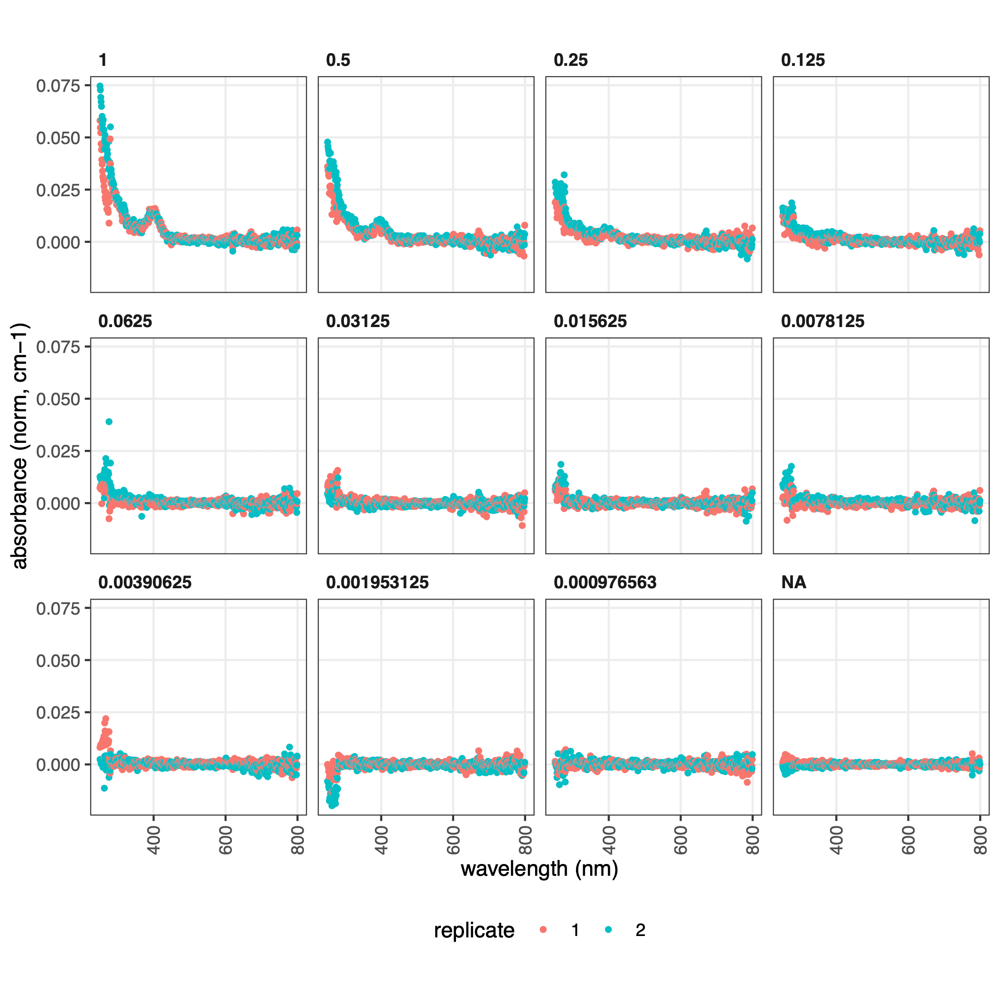
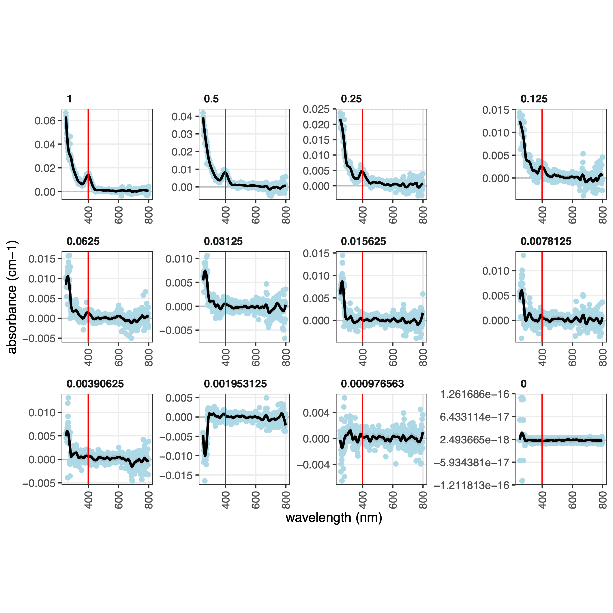
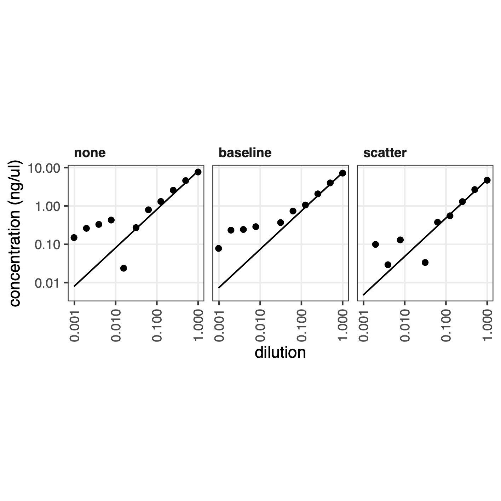
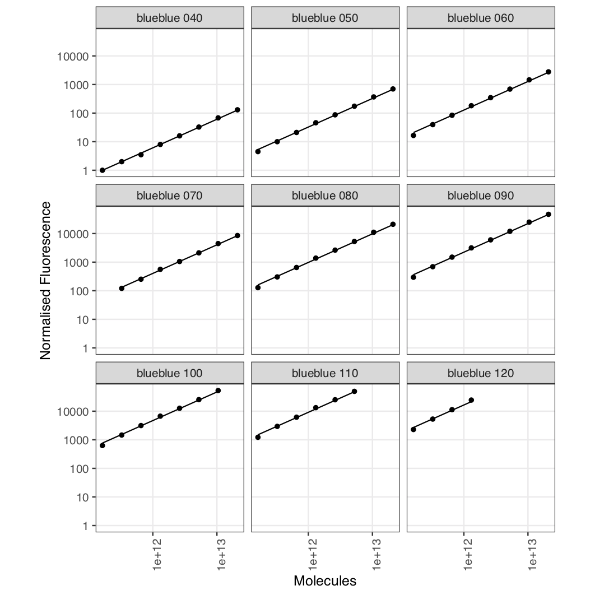
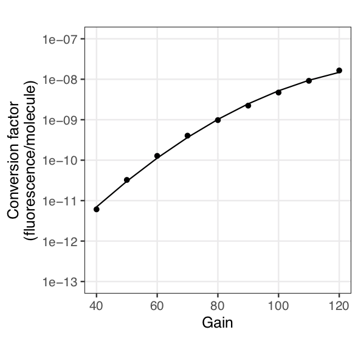
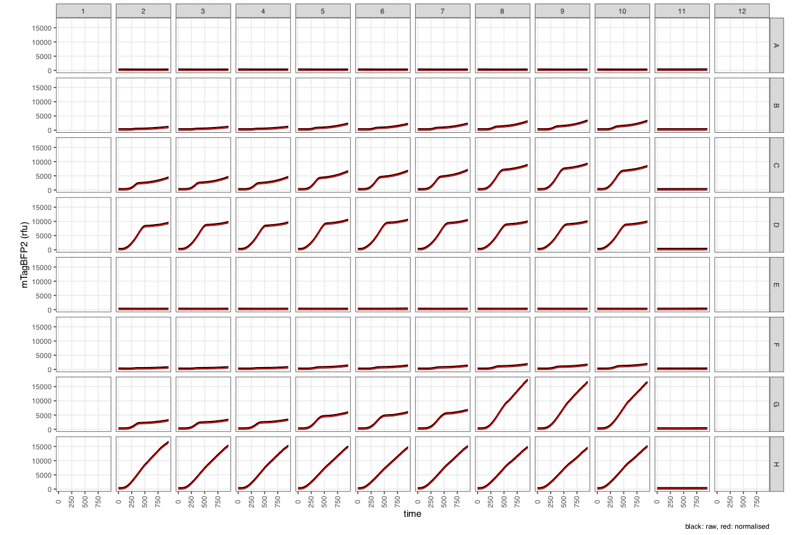
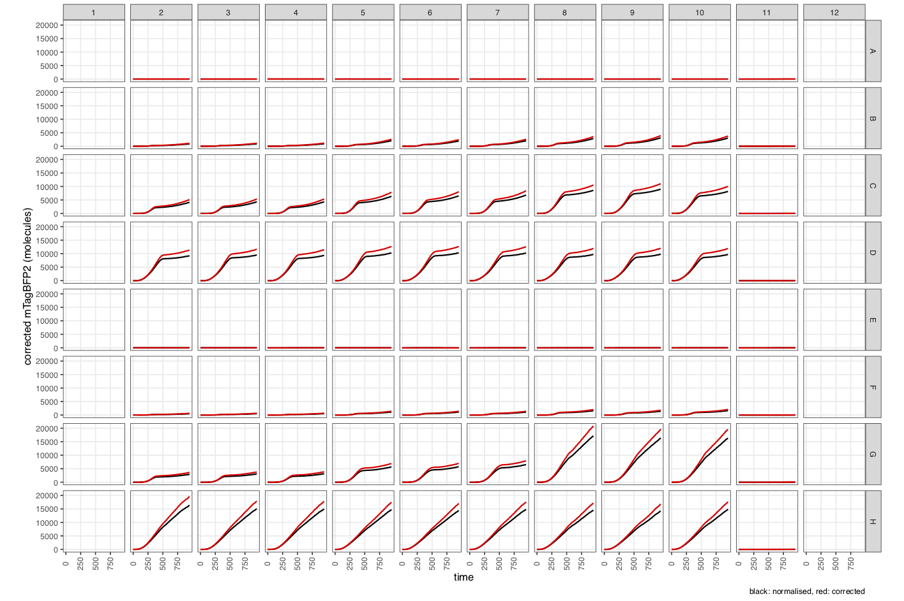
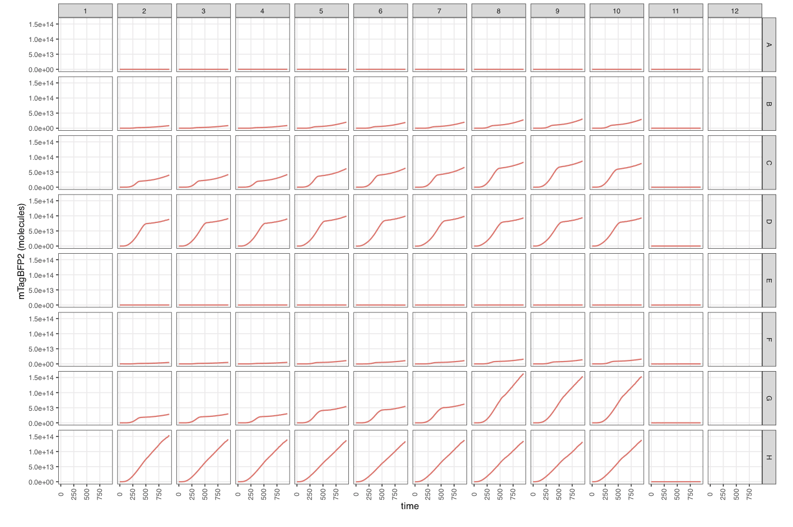
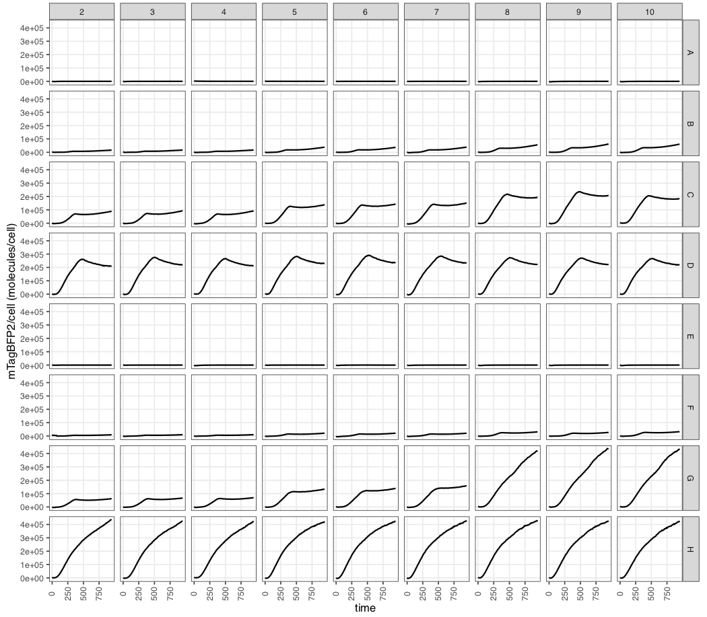
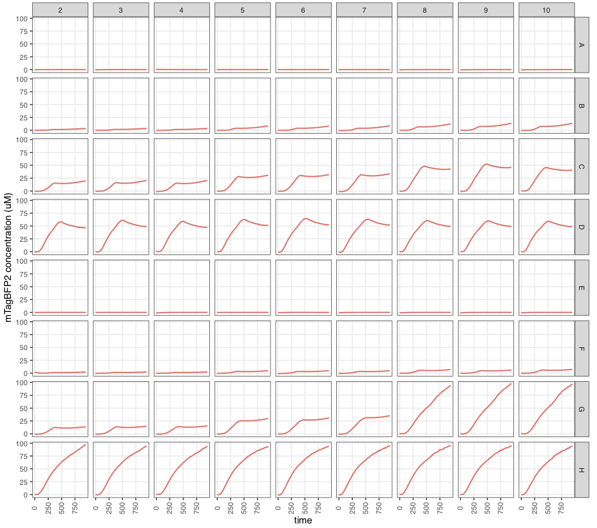

<style type="text/css">
code.r{ /* Code block */
    font-size: 11px;
}
pre { /* Code block - determines code spacing between lines */
    font-size: 13px;
}
</style>

```{r, setup, include=FALSE}
knitr::opts_chunk$set(eval = FALSE)
knitr::opts_chunk$set(echo = TRUE)
```

This page includes a full overview of `fpcountr` starting from package installation, through all steps of an example calibration and experimental data analysis. For more detail on the steps of this workflow, see the Articles.

<br>

## Installation

The package is written in R and can be installed straight from GitHub:

```{r, eval=FALSE}
# install.packages("devtools") # run this if you don't have devtools installed already
devtools::install_github("ec363/fpcountr") # run this to install fpcountr
```

You should only need to run the above code once.

<br>

## Example Scenario

<br> 

**Example Scenario: We wish to work out how many molecules of fluorescent protein are being produced from a vector expressing [mTagBFP2](https://www.fpbase.org/protein/ZO7NN/).** 

What we have: experimental data of mTagBFP2 expression, as well as an mTagBFP2 calibration carried out using the FPCountR method.

What we want to do is:

1. **create conversion factors** that describe how blue fluorescence from mTagBFP2 relates to its molecule number in our instrument.
2. use these conversion factors to interpret our experiment file, to work out the **number of proteins per cell expressed by our mTagBFP2 expression vectors** across different conditions.

The package comes with example data of exactly this type, and example code that will allow you to calculate protein numbers.

<br>

## Example Data

<br>

The following example data files are provided with this package:

```{r eval=TRUE, echo=FALSE}
df <- read.csv("data/vignetteintro_files.csv")

df |>
  gt::gt() |>

  # TABLE HEADER
  # header style
  gt::tab_style(
    locations = gt::cells_column_labels(),
    style = list(
      gt::cell_text(size = "small")
    )
  ) |>
  # TABLE BODY
  # font smaller
  gt::tab_style(
    locations = gt::cells_body(
      columns = tidyselect::everything()
    ),
    style = list(
      gt::cell_text(size = "small")
    )
  ) |>
  # # cell borders
  # gt::tab_style(
  #   locations = gt::cells_body(
  #     # columns = tidyselect::everything()
  #   ),
  #   style = list(
  #     gt::cell_borders(
  #       sides = c("top", "bottom"),
  #       color = NULL
  #     )
  #   )
  # ) |>
  # markdown
  gt::fmt_markdown(
    columns = tidyselect::everything()
  ) |>

  # width # by default as wide as it needs to be # but shrinks when font is made smaller
  gt::tab_options(table.width = gt::px(750))

```

This example data will be used in the script below.

To try it yourself, create a new folder for running the script in this vignette (e.g. call it `fpcountr_example`). Open a new R script in RStudio (File > New File > R Script), save it to that folder, and navigate to its current working directory (Session > Set Working Directory > To Source File Location).

To find the example data, run:

```{r, eval=FALSE}
system.file("extdata", "", package = "fpcountr", mustWork = TRUE)
```

This gives you the location of the files. Find this folder, copy all of the files listed here into a subfolder of the `fpcountr_example` called `data`.

<br>

## Example Code

<br>

All the code from here to the end of this vignette can be copied into your own script and run line by line. Most of these functions will take existing data files, process them, and save new files (data as CSV files, and plots as PDF files). The data files will be required for subsequent functions, whereas the plots are intended to let you check the progress of the functions and identify if something has gone wrong.

Load the `fpcountr` package and verify that you are in the `fpcountr_example` directory.

```{r, eval=TRUE}
library(fpcountr)
```

<br>

### Protein concentration determination with the ECmax assay

<br>

#### 1. Parse absorbance spectrum data

The first thing we need to do is to process our absorbance spectrum data file, but the exported data file is not in the right format for our processing function. So before we can process the data, we need to extract the data from the exported data file, tidy it and join it to metadata. This process is called parsing.

> **Parsing**: All raw data files exported from plate readers require 'parsing' before they can be processed by downstream functions. See `vignette("data_parsing")` for more details.

> **Metadata**: Parsing requires that metadata be joined to the data. While it is largely up to you what aspects of your experiments you record as metadata, each data-processing function in FPCountR expects a a minimum amount of metadata that is required for downstream analysis. See `vignette("data_parsing")` for details on what these are.

If using a Tecan Spark plate reader running Magellan software: use `parse_magellan_spectrum()`. If using other plate readers: see `vignette("data_parsing")`.

We used a Spark, so we'll use `parse_magellan_spectrum()`: this takes the absorbance data file (`example_absorbance.csv`), in the export format provided by our plate reader, and a user-produced metadata file (`example_absorbance_meta.csv`), and parses it into the correct format.

```{r, eval=TRUE, warning=FALSE}
parsed_data_spectrum <- parse_magellan_spectrum(
  data_csv = "data/example_absorbance.csv",
  metadata_csv = "data/example_absorbance_meta.csv",
  wellstart = "A1", wellend = "B12"
)
```

Arguments required:

- `data_csv` - file path of the absorbance data file
- `metadata_csv` - file path of the metadata file
- `wellstart` = "A1", `wellend` = "B12" - first and last wells of the data
  
Warnings expected:

- You will likely get the warning `NAs introduced by coercion`. This just means that empty wells were filled in with `NA` values.

Outputs produced:

- A processed data file of the name `[raw data filename]_parsed.csv` (here,`example_absorbance_parsed_processed.csv`), in the same location where the data was found.
- A dataframe (which we called `parsed_data_spectrum`) of the parsed data is returned, which can be used to inspect the parsing.

View a fragment of the data frame to check.

```{r, eval=FALSE, echo=TRUE}
parsed_data_spectrum[1:24,c(1:100)] # view a fragment of the dataframe
```

```{r, eval=TRUE, echo=FALSE, warning=FALSE}

# code to display
# # old
# parsed_data_spectrum[1:10,c(1:5,8,11:13)] # view a fragment of the dataframe
# # current
# parsed_data_spectrum[1:24,c(1:100)] # view a fragment of the dataframe

# table to display
data_to_display <- parsed_data_spectrum[1:24,c(1:100)] # otherwise very slow!
data_to_display |>
  gt::gt() |>
  # TABLE HEADER
  # header style
  gt::tab_style(
    locations = gt::cells_column_labels(),
    style = list(
      gt::cell_text(size = "small"),
      gt::cell_text(weight = "bold")
    )
  ) |>
  # TABLE BODY
  # font smaller
  gt::tab_style(
    locations = gt::cells_body(
      columns = tidyselect::everything()
    ),
    style = list(
      gt::cell_text(size = "small")
    )
  ) |>
  # TABLE SIZE
  # gt::tab_options(container.width = gt::px(800)) |> # don't specify, so it can change w window size
  gt::tab_options(container.height = gt::px(350)) # this is approx 10 rows: the header + 9 rows
```

<br>

As you can see, the data is now in tidy, with one column per variable, allowing automated processing in subsequent steps.

<br>

#### 2. Process absorbance spectrum data

Parsed spectrum data can then be processed. This involves calculation of the path length of the samples, adjusting the raw values to a path length of 1cm, and normalising the data to the blanks.

> **Path lengths**: Calculating path lengths accurately is an important part of this process. See `vignette("path_lengths")` for more information.

```{r, eval=FALSE}

# Create folder to hold the FP quantification function output files
dir.create("fp_quantification")

# Process spectra
processed_data_spectrum <- process_absorbance_spectrum(
  
  # basics
  spectrum_csv = "data/example_absorbance_parsed.csv",
  subset_rows = TRUE, rows_to_keep = c("A","B"), columns_to_keep = c(1:12),
  xrange = c(250,1000),
  
  # path length calcs
  pl_method = "calc_blanks",
  buffer_used = "TBS", concentration_used = 0.005, temperature_used = 30,
  
  # saving
  outfolder = "fp_quantification"
)
```

```{r, eval=TRUE, echo=FALSE, warning=FALSE}

# AS ABOVE BUT WITH CSV_ONLY = TRUE

# Create folder for get_concentration functions' output files
dir.create("fp_quantification")

# Process spectra (correct for for path length and normalise to blanks)
processed_data_spectrum <- process_absorbance_spectrum(
  
  # basics
  spectrum_csv = "data/example_absorbance_parsed.csv",
  subset_rows = TRUE, rows_to_keep = c("A","B"), columns_to_keep = c(1:12),
  xrange = c(250,1000),
  
  # path length calcs
  pl_method = "calc_blanks", # options: "calc_each", "calc_blanks", "volume"
  buffer_used = "TBS", concentration_used = 0.005, temperature_used = 30,
  
  # saving
  outfolder = "fp_quantification",
  csv_only = TRUE
)
```

Arguments required:

- `spectrum_csv` - location of the parsed spectrum data file
- `subset_rows`, `rows_to_keep`... - whether you want the function to consider only certain rows/columns of data. useful if you have multiple calibrants per plate, as this function can only handle one calibrant at a time
- `xrange` - the range of wavelengths you want the function to restrict analysis to. Input the wavelength range you used for the experiment. If this causes errors, it is often beneficial to filter on the UV end, e.g. use 350-1000 or 400-1000.
- `pl_method` - method to use for path length calculations. Options: `"calc_each"` (calculate the path length of each well separately), `"calc_blanks"` (calculate the path length of the blanks and use that for all wells), `"volume"` (calculate path length from given volume in the `volume` column). See `vignette("path_lengths")`.
- `buffer_used`, `concentration_used`, `temperature_used` - these related to path length calculation. The `buffer_used` must come from the list in `view_kfactors()`, so use `view_kfactors()` to find the closest buffer. Similarly, `concentration_used` must use the same units as the buffer it refers to in the `view_kfactors()` table. See `vignette("path_lengths")`.
- `outfolder` - where to save the files.
  
Warnings expected:

- You will likely get warnings about `rows containing missing values`. This is normal.

Outputs produced:

..in the designated `outfolder` (here, `fp_quantification/`):

- A processed data file of the name `[raw data filename]_parsed_processed.csv` (here,`example_absorbance_parsed_processed.csv`).
- A list of plots in designated `outfolder`:
  - `plot1a_raw.pdf` - raw data overview
  - `plot1b_raw_blanks.pdf` - raw absorbance of the blank wells
  - `plot2a_a9001000.pdf` - raw data at 900-1000nm (relevant for path length calculation)
  - `plot2b_pathlengths.pdf` - path length estimations by all three methods (regardless of which was chosen)
  - `plot2c_rawcm1.pdf` - raw data normalised to pathlength = 1cm
  - `plot3_normcm1.pdf` - data normalised to blank wells (**where the fluorescent protein peaks usually become visible**)
  - `plot4_mean_normcm1.pdf` - mean of the normalised data, across replicates

..in RStudio:

- In the R console, messages will let you follow the progress of the data processing.
- A dataframe (which we called `processed_data_spectrum`) of the processed data is returned, which can be used to inspect the processing.

Let's have a look at a fragment of the processed data:

```{r, eval=FALSE, echo=TRUE}
processed_data_spectrum[195:225,c(1:3,7,9,10,12,13)] # view a fragment of the dataframe
```

```{r, eval=TRUE, echo=FALSE, warning=FALSE}

# nrow(processed_data_spectrum) # 9000

# code to display
# # old
# processed_data_spectrum[1:10,c(1:3,5,7,9:13)] # view a fragment of the dataframe
# # current
# processed_data_spectrum[195:225,c(1:3,7,9,10,12,13)] # view a fragment of the dataframe

data_to_display <- processed_data_spectrum[195:225,c(1:3,7,9,10,12,13)] # otherwise very slow!
data_to_display |>
  gt::gt() |>
  # TABLE HEADER
  # header style
  gt::tab_style(
    locations = gt::cells_column_labels(),
    style = list(
      gt::cell_text(size = "small"),
      gt::cell_text(weight = "bold")
    )
  ) |>
  # TABLE BODY
  # font smaller
  gt::tab_style(
    locations = gt::cells_body(
      columns = tidyselect::everything()
    ),
    style = list(
      gt::cell_text(size = "small")
    )
  ) |>
  # NEW COLS
  gt::tab_style(
    locations = gt::cells_column_labels(
      columns = c(raw_value, raw_cm1_value, normalised_cm1_value)
    ),
    style = list(
      gt::cell_text(color = "red")
    )
  ) |>
  gt::tab_style(
    locations = gt::cells_body(
      columns = c(raw_value, raw_cm1_value, normalised_cm1_value)
    ),
    style = list(
      gt::cell_text(color = "red")
    )
  ) |>
  # TABLE SIZE
  # gt::tab_options(container.width = gt::px(800)) |> # don't specify, so it can change w window size
  gt::tab_options(container.height = gt::px(350)) # this is approx 10 rows: the header + 9 rows
```

Note the new columns in red. The `normalised_cm1_value` column will be used for calculating the concentration of the FP in the next step.

While the absolute numbers are low, we can verify that the peak of absorbance of mTagBFP2 is 401 nm.

This is more easily evident in the plots, where we can also verify that the blanks are not too noisy and that the replicates were similar:

<p align="center">
  
</p>

<br>

#### 3. Get concentration using ECmax assay

Using this processed data, we can now work out the concentration of the FP in each dilution using the `get_conc_ecmax()` function. This takes the EC and excitation maximum of the FP in question from FPbase, and calculates the concentration from the absorbance at that position. It also normalises carefully for background signal in one of 3 ways.

Code:

```{r, eval=FALSE}
proteinconcs <- get_conc_ecmax(
  protein_slug = "mtagbfp2",
  protein_seq = "MVHHHHHHGSGVSKGEELIKENMHMKLYMEGTVDNHHFKCTSEGEGKPYEGTQTMRIKVVEGGPLPFAFDILATSFLYGSKTFINHTQGIPDFFKQSFPEGFTWERVTTYEDGGVLTATQDTSLQDGCLIYNVKIRGVNFTSNGPVMQKKTLGWEAFTETLYPADGGLEGRNDMALKLVGGSHLIANAKTTYRSKKPAKNLKMPGVYYVDYRLERIKEANNETYVEQHEVAVARYCDLPSKLGHKLN",
  processed_spectrum_csv = "fp_quantification/example_absorbance_parsed_processed.csv",
  # wells_to_remove = c(),
  corr_method = "scatter", wav_to_use1 = 500, wav_to_use2 = 450,
  outfolder = "fp_quantification/concentration",
)
```

```{r, eval=TRUE, echo=FALSE, warning=FALSE}

# AS ABOVE BUT WITH CSV_ONLY = TRUE

proteinconcs <- get_conc_ecmax(
  protein_slug = "mtagbfp2",
  protein_seq = "MVHHHHHHGSGVSKGEELIKENMHMKLYMEGTVDNHHFKCTSEGEGKPYEGTQTMRIKVVEGGPLPFAFDILATSFLYGSKTFINHTQGIPDFFKQSFPEGFTWERVTTYEDGGVLTATQDTSLQDGCLIYNVKIRGVNFTSNGPVMQKKTLGWEAFTETLYPADGGLEGRNDMALKLVGGSHLIANAKTTYRSKKPAKNLKMPGVYYVDYRLERIKEANNETYVEQHEVAVARYCDLPSKLGHKLN",
  processed_spectrum_csv = "fp_quantification/example_absorbance_parsed_processed.csv",
  # wells_to_remove = c(),
  corr_method = "scatter", wav_to_use1 = 500, wav_to_use2 = 450,
  outfolder = "fp_quantification/concentration",
  csv_only = TRUE
)
```

Arguments required:

- `protein_slug` - the short / lower-case form name of your FP, used to search FPbase
- `protein_seq` - the sequence of your protein, for molecular weight calculations
- `processed_spectrum_csv` - location of the processed spectrum data file
- `wells_to_remove` - list of wells you might want to remove (e.g. if identified as anomalous in previous step)
- `corr_method`, `wav_to_use1`, `wav_to_use2` - correction method for path length correction. choose from "none" (no normalisation - absorbance at excitation maximum is used directly), "background" (subtract absorbance at `wav_to_use1` wavelength) or "scatter" (extrapolate, using `wav_to_use2` wavelength, the precise background to subtract).
- `outfolder` - where to save the files

Warnings expected:

- You will likely get warnings about `transformation : NaNs produced`, `log-10 transformation introduced infinite values` and `rows containing missing values`. These are normal.

Outputs produced:

..in the designated `outfolder` (here, `fp_quantification/concentration/`):

- A processed data file of the name `[raw data filename]_parsed_processed_ecmax.csv` (here,`example_absorbance_parsed_processed_ecmax.csv`).
- A small table containing estimated concentrations using all 3 normalisation methods: `ecmax_coeffs.csv`.
- **A table of protein concentrations joined to metadata, `protein_concs_ecmax.csv`, required for combining with fluorescence data in the next step, for calculating conversion factors.**
- A list of plots:
  - `plot1_abs_spectra_replicates.pdf` - data normalised to blank wells (identical to `plot3_normcm1.pdf` from `process_absorbance_spectrum()`)
  - `plot3a_abs_spectra_geomsmooth.pdf` - same data as in plot1 plotted with the geom_smooth plotting function and annotated with the excitation maximum wavelength from FPbase. this serves as a check in case model fitting fails in next steps.
  - **`plot3b_abs_spectra_modelcheck.pdf` - the results of LOESS model fitting through the absorbance data and and annotated with the excitation maximum wavelength from FPbase. Good plot to check that the model fitting worked and the FPbase excitation maximum matches the observed excitation maximum.**
  - `plot5a_ecmax.pdf` - illustrates steps of processing: raw data, normalised data (red) and fitted data (blue).
  - `plot5b_ecmax_stdmethod.pdf` - visualisation of the linear fitting of data normalised with correction method "none"
  - `plot5c_ecmax_baselinenorm.pdf` - visualisation of the linear fitting of data normalised with correction method "baseline"
  - `plot5c_ecmax_baselinenorm_baselinecheck.pdf` - visualisation of the normalisation procedure using scatter
  - `plot5d_ecmax_scatternorm.pdf` - visualisation of the linear fitting of data normalised with correction method "scatter"
  - `plot5d_ecmax_scatternorm_scattercheck.pdf` - visualisation of the normalisation procedure using scatter
  - `plot6a_ecmax_models_all.pdf` - comparison of concentration vs dilution relationships across all normalisation methods
  - **`plot6b_ecmax_models_all_logplot.pdf` - comparison of concentration vs dilution relationships across all normalisation methods as a log plot.** Best place to verify choice of normalisation method.

.. in RStudio:

- A dataframe (which we called `proteinconcs`) of the protein concentrations in each well, which can be used to inspect the processing.

```{r, eval=FALSE, echo=TRUE}
proteinconcs[1:12,] # view a fragment of the dataframe
```

```{r, eval=TRUE, echo=FALSE, warning=FALSE}

# nrow(proteinconcs) # 24
# ncol(proteinconcs) # 8

# code to display
# # old
# proteinconcs[1:10,] # view a fragment of the dataframe
# # current
# proteinconcs[1:12,] # view a fragment of the dataframe

data_to_display <- proteinconcs[1:12,]
data_to_display |>
  gt::gt() |>
  # TABLE HEADER
  # header style
  gt::tab_style(
    locations = gt::cells_column_labels(),
    style = list(
      gt::cell_text(size = "small"),
      gt::cell_text(weight = "bold")
    )
  ) |>
  # TABLE BODY
  # font smaller
  gt::tab_style(
    locations = gt::cells_body(
      columns = tidyselect::everything()
    ),
    style = list(
      gt::cell_text(size = "small")
    )
  ) |>
  # NEW COLS
  gt::tab_style(
    locations = gt::cells_column_labels(
      columns = c(concentration_ngul)
    ),
    style = list(
      gt::cell_text(color = "red")
    )
  ) |>
  gt::tab_style(
    locations = gt::cells_body(
      columns = c(concentration_ngul)
    ),
    style = list(
      gt::cell_text(color = "red")
    )
  ) #|>
  # TABLE SIZE
  # gt::tab_options(container.width = gt::px(800)) |> # don't specify, so it can change w window size
  # gt::tab_options(container.height = gt::px(350)) # this is approx 10 rows: the header + 9 rows
```

The example data should give 6.8 ng/ul for the top concentration.

Plot3a that illustrates the model fitting to the spectra and identification of the excitation maximum of mTagBFP2:

<p align="center">
  
</p>

Plot6b that compares the linear fit of the concentrations across normalisation techniques:

<p align="center">
  
</p>

<br>

### Conversion factor calculation

<br>

Create a folder for this calculation:

```{r, eval=TRUE, warning=FALSE}
dir.create("conversion_factors")
```

Assemble the metadata file, using the original metadata file, and the protein concentrations file just obtained from the ECmax assay above.

```{r, eval=TRUE}
# Join files
fluorescence_meta1 <- read.csv("data/example_fluorescence_meta.csv")
fluorescence_meta2 <- read.csv("fp_quantification/concentration/protein_concs_ecmax.csv")
fluorescence_meta_joined <- dplyr::left_join(x = fluorescence_meta1, y = fluorescence_meta2)
fluorescence_meta_joined <- cbind(fluorescence_meta_joined[ , !names(fluorescence_meta_joined) %in% c("well")], fluorescence_meta_joined[ , "well"]) # move well column to right hand side - important for `generate_cfs()`
names(fluorescence_meta_joined)[ncol(fluorescence_meta_joined)] <- "well" # rename last column
write.csv(x = fluorescence_meta_joined,
          file = "conversion_factors/example_fluorescence_meta_joined.csv", 
          row.names = FALSE)
```

```{r, eval=FALSE, echo=TRUE}
fluorescence_meta_joined[1:12,c(1,4,7,8,10,12:15)]
```

```{r, eval=TRUE, echo=FALSE, warning=FALSE}

# nrow(fluorescence_meta_joined) # 96
# ncol(fluorescence_meta_joined) # 15

# code to display
# # old
# fluorescence_meta_joined[1:10,c(1,4,7,8,10,12:15)]
# # current
# fluorescence_meta_joined[1:12,c(1,4,7,8,10,12:15)]

data_to_display <- fluorescence_meta_joined[1:12,c(1,4,7,8,10,12:15)]
data_to_display |>
  gt::gt() |>
  # TABLE HEADER
  # header style
  gt::tab_style(
    locations = gt::cells_column_labels(),
    style = list(
      gt::cell_text(size = "small"),
      gt::cell_text(weight = "bold")
    )
  ) |>
  # TABLE BODY
  # font smaller
  gt::tab_style(
    locations = gt::cells_body(
      columns = tidyselect::everything()
    ),
    style = list(
      gt::cell_text(size = "small")
    )
  ) |>
  # NEW COLS
  gt::tab_style(
    locations = gt::cells_column_labels(
      columns = c(concentration_ngul)
    ),
    style = list(
      gt::cell_text(color = "red")
    )
  ) |>
  gt::tab_style(
    locations = gt::cells_body(
      columns = c(concentration_ngul)
    ),
    style = list(
      gt::cell_text(color = "red")
    )
  ) #|>
  # TABLE SIZE
  # gt::tab_options(container.width = gt::px(800)) |> # don't specify, so it can change w window size
  # gt::tab_options(container.height = gt::px(350)) # this is approx 10 rows: the header + 9 rows
```

You should be able to see that the concentration values have been joined to the other metadata. This joined metadata file will be our metadata for the fluorescence assay.

<br>

#### 1. Parse fluorescence data

Parse the data. Here we're using a different parsing function that handles standard (endpoint) and timecourse (kinetic) data from Tecan Spark instruments running Magellan software. See **Data Parsing** article if you have a different setup.

```{r, eval=TRUE, warning=FALSE}
parsed_data <- parse_magellan(data_csv = "data/example_fluorescence.csv",
                              metadata_csv = "conversion_factors/example_fluorescence_meta_joined.csv",
                              timeseries = FALSE
)
```

Arguments required:

- `data_csv` - file path of the absorbance data file
- `metadata_csv` - file path of the metadata file
- `timeseries` - whether or not the data is a timeseries/timecourse/kinetic.

Warnings expected:

- You will likely get the warning `NAs introduced by coercion`. This just means that empty wells were filled in with `NA` values.

Outputs produced:

- A processed data file of the name `[raw data filename]_parsed.csv` (here,`example_fluorescence_parsed.csv`), in the same location where the data was found.
- A dataframe (which we called `parsed_data`) of the parsed data is returned, which can be used to inspect the parsing.

View a fragment of the data frame to check.

```{r, eval=FALSE, echo=TRUE}
parsed_data[1:12,c(1,4,8,12,14:24)] # view a fragment of the dataframe
```

```{r, eval=TRUE, echo=FALSE, warning=FALSE}

# nrow(parsed_data) # 96
# ncol(parsed_data) # 26

# code to display
# # old
# parsed_data[1:10,c(1,4,8,12,14:24)] # view a fragment of the dataframe
# # current
# parsed_data[1:12,c(1,4,8,12,14:24)] # view a fragment of the dataframe

data_to_display <- parsed_data[1:12,c(1,4,8,12,14:24)]
data_to_display |>
  gt::gt() |>
  # TABLE HEADER
  # header style
  gt::tab_style(
    locations = gt::cells_column_labels(),
    style = list(
      gt::cell_text(size = "small"),
      gt::cell_text(weight = "bold")
    )
  ) |>
  # TABLE BODY
  # font smaller
  gt::tab_style(
    locations = gt::cells_body(
      columns = tidyselect::everything()
    ),
    style = list(
      gt::cell_text(size = "small")
    )
  ) |>
  # NEW COLS
  gt::tab_style(
    locations = gt::cells_column_labels(
      columns = tidyselect::starts_with("blueblue")
    ),
    style = list(
      gt::cell_text(color = "red")
    )
  ) |>
  gt::tab_style(
    locations = gt::cells_body(
      columns = tidyselect::starts_with("blueblue")
    ),
    style = list(
      gt::cell_text(color = "red")
    )
  ) #|>
  # TABLE SIZE
  # gt::tab_options(container.width = gt::px(800)) |> # don't specify, so it can change w window size
  # gt::tab_options(container.height = gt::px(350)) # this is approx 10 rows: the header + 9 rows
```

Note the fact that the data is now in Tidy Format, with each fluorescence reading (at gains of 40, 50, etc..) in its own column, ready for processing.

<br>

#### 2. Generate conversion factors

Use `generate_cfs()` to generate conversion factors that relates fluorescence brightness to molecule number.

```{r, eval=TRUE, warning=FALSE}
fp_conversion_factors <- generate_cfs(
  calibration_csv = "data/example_fluorescence_parsed.csv",
  subset_rows = TRUE, rows_to_keep = c("A","B"),
  outfolder = "conversion_factors"
)
```

Arguments required:

- `calibration_csv` - location of the parsed fluorescent data file
- `subset_rows`, `rows_to_keep`... - whether you want the function to consider only certain rows/columns of data. useful if you have multiple calibrants per plate, as this function can only handle one calibrant at a time
- `outfolder` - where to save the files

Warnings expected:

- You will likely get warnings about `NaNs produced`. These are normal.

Outputs produced:

..in the designated `outfolder` (here, `conversion_factors/`):

- A processed data file of the name `[raw data filename]_parsed_cfs.csv` (here,`example_fluorescence_parsed_cfs.csv`).
- Four plots showing showing the fitting between normalised fluorescence and molecule number, and a gain vs conversion factor plot (if you have tested multiple gains).

.. in RStudio:

- A dataframe (which we called `fp_conversion_factors`) of the conversion factors at each concentration.

> For Advanced options for this function, see `?generate_cfs()`.

Let's check how the conversion factor table looks:

```{r, eval=FALSE, echo=TRUE}
fp_conversion_factors[,c(1,4,8:13)] # view a fragment of the dataframe
```

```{r, eval=TRUE, echo=FALSE, warning=FALSE}

# nrow(fp_conversion_factors) # 9
# ncol(fp_conversion_factors) # 13

# code to display
# # old
# fp_conversion_factors[,c(1,4,8:13)] # view a fragment of the dataframe
# # current
# fp_conversion_factors[,c(1,4,8:13)] # view a fragment of the dataframe

data_to_display <- fp_conversion_factors[,c(1,4,8:13)]
data_to_display |>
  gt::gt() |>
  # TABLE HEADER
  # header style
  gt::tab_style(
    locations = gt::cells_column_labels(),
    style = list(
      gt::cell_text(size = "small"),
      gt::cell_text(weight = "bold")
    )
  ) |>
  # TABLE BODY
  # font smaller
  gt::tab_style(
    locations = gt::cells_body(
      columns = tidyselect::everything()
    ),
    style = list(
      gt::cell_text(size = "small")
    )
  ) |>
  # NEW COLS
  gt::tab_style(
    locations = gt::cells_column_labels(
      columns = c(cf, beta, residuals)
    ),
    style = list(
      gt::cell_text(color = "red")
    )
  ) |>
  gt::tab_style(
    locations = gt::cells_body(
      columns = c(cf, beta, residuals)
    ),
    style = list(
      gt::cell_text(color = "red")
    )
  ) #|>
  # TABLE SIZE
  # gt::tab_options(container.width = gt::px(800)) |> # don't specify, so it can change w window size
  # gt::tab_options(container.height = gt::px(350)) # this is approx 10 rows: the header + 9 rows
```

Here, `cf` is conversion factor and `residuals` allows you to check the quality of the fit. We can see the fits are good, which we can also see by looking at the plots:

<p align="center">
  
</p>

<!-- <p align="center"> -->
<!--    -->
<!-- </p> -->

<br>

### Assemble conversion factors

<br>

#### FP conversion factors

If multiple FPs are being calibrated, assembly can be used to join various files together. Here we will just simplify the conversion factor file and move it into a conversion factor folder.

```{r, eval=TRUE}
fp_conversion_factors <- read.csv("conversion_factors/example_fluorescence_parsed_cfs.csv")
fp_conversion_factors <- fp_conversion_factors |>
  dplyr::select(instrument, plate, channel_name, media, calibrant, measure, gain, cf, beta)
write.csv(fp_conversion_factors, "conversion_factors/fp_conversion_factors_assembled.csv", 
          row.names = FALSE)
```

<br>

#### OD conversion factors

These can be obtained according to protocols in the FlopR package/paper. An example calibration output is provided with the example data. Let's move it to the conversion factors folder too.

```{r, eval=TRUE}
od_conversion_factors <- read.csv("data/od_conversion_factors2.csv")
write.csv(od_conversion_factors, "conversion_factors/od_conversion_factors_assembled.csv",
          row.names = FALSE)
```

```{r, eval=FALSE, echo=TRUE}
od_conversion_factors
```

```{r, eval=TRUE, echo=FALSE, warning=FALSE}

# nrow(od_conversion_factors) # 2
# ncol(od_conversion_factors) # 5

data_to_display <- od_conversion_factors
data_to_display |>
  gt::gt() |>
  # TABLE HEADER
  # header style
  gt::tab_style(
    locations = gt::cells_column_labels(),
    style = list(
      gt::cell_text(size = "small"),
      gt::cell_text(weight = "bold")
    )
  ) |>
  # TABLE BODY
  # font smaller
  gt::tab_style(
    locations = gt::cells_body(
      columns = tidyselect::everything()
    ),
    style = list(
      gt::cell_text(size = "small")
    )
  ) #|>
  # TABLE SIZE
  # gt::tab_options(container.width = gt::px(800)) |> # don't specify, so it can change w window size
  # gt::tab_options(container.height = gt::px(350)) # this is approx 10 rows: the header + 9 rows
```

<br>

### Processing data from _E. coli_ fluorescent protein expression experiments

<br>

With conversion factors for both mTagBFP2 fluorescence and cell number (OD) in hand, we are ready to process the experimental data.

#### 1. Parse data

First, we parse, though this time we use `timeseries = TRUE`:

```{r, eval=TRUE}
parsed_data <- parse_magellan(
  data_csv = "data/example_experiment.csv",
  metadata_csv = "data/example_experiment_meta.csv",
  timeseries = TRUE,
  metadata_above = 1, # Well Positions
  custom = TRUE, startcol = 3, endcol = 97, insert_wells_above = 0, insert_wells_below = 1
)
```

Arguments required:

- `data_csv` - file path of the absorbance data file
- `metadata_csv` - file path of the metadata file
- `timeseries` - whether or not the data is a timeseries/timecourse/kinetic.
- `metadata_above` - number of lines of plate reader-produced metadata that exists above the data
- `custom`, `startcol`, `insert_wells_above`.. - use `custom = TRUE` where the data doesn't occupy the default columns 2 to 97. The others specify where the data is located. See `?parse_magellan()`.

Warnings expected:

- You will likely get the warning `NAs introduced by coercion`. This just means that empty wells were filled in with `NA` values.

Outputs produced:

- A processed data file of the name `[raw data filename]_parsed.csv` (here,`example_experiment_parsed.csv`), in the same location where the data was found.
- A dataframe (which we called `parsed_data`) of the parsed data is returned, which can be used to inspect the parsing.

```{r, eval=FALSE, echo=TRUE}
parsed_data[1:24,c(3,6:13)] # view a fragment of the dataframe
```

```{r, eval=TRUE, echo=FALSE, warning=FALSE}

# nrow(parsed_data) # 9000
# ncol(parsed_data) # 16

# code to display
# # old
# parsed_data[1:10,c(3,6,8:15)] # view a fragment of the dataframe
# # current
# parsed_data[1:24,c(3,6:13)] # view a fragment of the dataframe

data_to_display <- parsed_data[1:24,c(3,6:13)]
data_to_display |>
  gt::gt() |>
  # TABLE HEADER
  # header style
  gt::tab_style(
    locations = gt::cells_column_labels(),
    style = list(
      gt::cell_text(size = "small"),
      gt::cell_text(weight = "bold")
    )
  ) |>
  # TABLE BODY
  # font smaller
  gt::tab_style(
    locations = gt::cells_body(
      columns = tidyselect::everything()
    ),
    style = list(
      gt::cell_text(size = "small")
    )
  ) |>
  # NEW COLS
  gt::tab_style(
    locations = gt::cells_column_labels(
      columns = c(OD600, OD700, blue, bluelow)
    ),
    style = list(
      gt::cell_text(color = "red")
    )
  ) |>
  gt::tab_style(
    locations = gt::cells_body(
      columns = c(OD600, OD700, blue, bluelow)
    ),
    style = list(
      gt::cell_text(color = "red")
    )
  ) |>
  # TABLE SIZE
  # gt::tab_options(container.width = gt::px(800)) |> # don't specify, so it can change w window size
  gt::tab_options(container.height = gt::px(350)) # this is approx 10 rows: the header + 9 rows
```

Note the data consists of two OD measurements and two fluorescence measurements at low and high gain.

<br>

#### 2. Process data

Process the experimental data using `process_plate()`.

```{r, eval=FALSE}
processed_data <- process_plate(
  data_csv = "data/example_experiment_parsed.csv",
  blank_well = c("A11", "B11", "C11", "D11", "E11", "F11", "G11", "H11"),
  od_name = "OD700",
  
  # fluorescence labels
  flu_channels = c("blue"),
  flu_channels_rename = c("blueblue"),
  
  # correction
  do_quench_correction = TRUE,
  od_type = "OD700",
  
  # calibrations
  do_calibrate = TRUE,
  instr = "spark1",
  flu_slugs = c("mTagBFP2"),
  flu_gains = c(60),
  flu_labels = c("mTagBFP2"),
  
  # conversion factors
  od_coeffs_csv = "conversion_factors/od_conversion_factors_assembled.csv",
  fluor_coeffs_csv = "conversion_factors/fp_conversion_factors_assembled.csv",
  
  # background autofluorescence subtraction
  af_model = "spline",
  neg_well = c("A2", "A3", "A4", "A5", "A6", "A7"),
  
  outfolder = "experiment_analysis"
)
```

```{r, eval=TRUE, echo=FALSE, warning=FALSE}

# AS ABOVE BUT WITH CSV_ONLY = TRUE

processed_data <- process_plate(
  data_csv = "data/example_experiment_parsed.csv",
  blank_well = c("A11", "B11", "C11", "D11", "E11", "F11", "G11", "H11"),
  od_name = "OD700",
  
  # fluorescence labels
  flu_channels = c("blue"),
  flu_channels_rename = c("blueblue"),
  
  # correction
  do_quench_correction = TRUE,
  od_type = "OD700",
  
  # calibrations
  do_calibrate = TRUE,
  instr = "spark1",
  flu_slugs = c("mTagBFP2"),
  flu_gains = c(60),
  flu_labels = c("mTagBFP2"),
  
  # conversion factors
  od_coeffs_csv = "conversion_factors/od_conversion_factors_assembled.csv",
  fluor_coeffs_csv = "conversion_factors/fp_conversion_factors_assembled.csv",
  
  # background autofluorescence subtraction
  af_model = "spline",
  neg_well = c("A2", "A3", "A4", "A5", "A6", "A7"),
  
  outfolder = "experiment_analysis",
  csv_only = TRUE
)
```

This is a fairly involved function.

Arguments required:

- `data_csv` - file path of the absorbance data file
- `blank_well` - location of wells containing only growth media
- `od_name` - name of column containing OD values

Fluorescence channel names:

- `flu_channels` - column names in your data that represent the fluorescence channel(s)
- `flu_channels_rename` - what to rename `flu_channels` columns to, if anything. it can be useful to rename them here to make sure your experimental data columns match the entries in your conversion factor table for that fluorescence channel/filter set.

Quench correction:

- `do_quench_correction` - should it calculate corrected fluorescence values based on cellular fluorescence quenching?
- `od_type` - was the OD taken at 600 or 700 nm?

Calibration parameters:

- `do_calibrate` - should it calibrate fluorescence and OD values?
- `instr` - what is the instrument name used in this experiment (to be matched to calibrations)
- `flu_slugs` - the short / lower-case form name of your FP (to be matched to calibrations)
- `flu_gains` - gain used in experiment (to be matched to calibrations)
- `flu_labels` - what to label fluorescence axes in plots

Conversion factor data:

- `od_coeffs_csv` - file path of OD conversion factor file
- `fluor_coeffs_csv` - file path of fluorescence conversion factor file

Background autofluorescence subtraction:

- `af_model` - what sort of autofluorescence model to use. options include NULL, which doesn't use an autofluorescence model but instead normalises to the fluorescence in blank wells by time point.
- `neg_well` - wells with cells but no FP to use for autofluorescence subtraction

Saving:

- `outfolder` - where to save the files

Warnings expected:
  
- You will likely get the warning `rows containing missing values or values outside the scale range`. This is normal.

Outputs produced:

..in the designated `outfolder` (here, `experiment_analysis/`):

- A processed data file of the name `[raw data filename]_parsed_processed.csv` (here,`example_experiment_parsed_processed.csv`).
- A list of plots:
  - `OD_1_raw_normalised` - Raw and normalised OD data.
  - `OD_2_pathlength-normalised` - OD data normalised to 1 cm path length (in OD cm^-1^).
  - `OD_3_calibrated` - Calibrated OD data (in 'particles' or 'cells').
  - `blueblue_autofluorescence-normalisation-curve.pdf` - Autofluorescence normalisation curve: how background fluorescence in non-fluorescent cells relates to their OD.
  - `mTagBFP2_1_raw_normalised` - Raw and normalised fluorescence data (in 'relative fluorescence units').
  - `mTagBFP2_2_quench-corrected` - Fluorescence data corrected for cell-based quenching (in 'relative fluorescence units').
  - `mTagBFP2_3_calibrated` - Calibrated fluorescence data (in molecules).

.. in RStudio:

- A dataframe (which we called `processed_data`) of the conversion factors at each concentration.

> For Advanced options for this function, see `?process_plate()`.

If we view a fragment of the dataframe to check it:

```{r, eval=FALSE, echo=TRUE}
processed_data[14:24,c(3,6,8,9,17:23)] # view a fragment of the dataframe
```

```{r, eval=TRUE, echo=FALSE, warning=FALSE}

# nrow(processed_data) # 9000
# ncol(processed_data) # 23

# code to display
# # old
# processed_data[14:24,c(3,6,8,9,17:23)] # view a fragment of the dataframe
# # current
# processed_data[14:24,c(3,6,8,9,17:23)] # view a fragment of the dataframe

data_to_display <- processed_data[14:24,c(3,6,8,9,17:23)]
data_to_display |>
  gt::gt() |>
  # TABLE HEADER
  # header style
  gt::tab_style(
    locations = gt::cells_column_labels(),
    style = list(
      gt::cell_text(size = "small"),
      gt::cell_text(weight = "bold")
    )
  ) |>
  # TABLE BODY
  # font smaller
  gt::tab_style(
    locations = gt::cells_body(
      columns = tidyselect::everything()
    ),
    style = list(
      gt::cell_text(size = "small")
    )
  ) |>
  # NEW COLS
  gt::tab_style(
    locations = gt::cells_column_labels(
      columns = c(pathlength, normalised_OD_cm1, normalised_blueblue, flu_quench, corrected_normalised_blueblue, calibrated_OD, calibrated_mTagBFP2)
    ),
    style = list(
      gt::cell_text(color = "red")
    )
  ) |>
  gt::tab_style(
    locations = gt::cells_body(
      columns = c(pathlength, normalised_OD_cm1, normalised_blueblue, flu_quench, corrected_normalised_blueblue, calibrated_OD, calibrated_mTagBFP2)
    ),
    style = list(
      gt::cell_text(color = "red")
    )
  ) |>
  # TABLE SIZE
  # gt::tab_options(container.width = gt::px(800)) |> # don't specify, so it can change w window size
  gt::tab_options(container.height = gt::px(350)) # this is approx 10 rows: the header + 9 rows
```

Note the many new columns created by `process_plate()`.

<br>

Normalisation (black=raw, red=normalised):
<p align="center">
  
</p>

Quench correction (black=normalised, red=corrected):
<p align="center">
  
</p>

Calibration (red=calibrated):
<p align="center">
  
</p>

<br>

#### 3. Calculate per cell values

`calc_fppercell()` can be used to estimate molecules per cell.

```{r, eval=TRUE}
pc_data_mTagBFP2 <- calc_fppercell(
  data_csv = "experiment_analysis/example_experiment_parsed_processed.csv",
  flu_channels = c("blueblue"),
  flu_labels = c("mTagBFP2"),
  remove_wells = c("A11", "B11", "C11", "D11", "E11", "F11", "G11", "H11", # media
                   "A1", "B1", "C1", "D1", "E1", "F1", "G1", "H1", 
                   "A12", "B12", "C12", "D12", "E12", "F12", "G12", "H12"), # empty wells
  get_rfu_od = FALSE,
  get_mol_cell = TRUE,
  outfolder = "experiment_analysis"
)
```

Arguments required:

- `data_csv` - file path of the absorbance data file
- `flu_channels` - column names in your data that represent the fluorescence channel(s)
- `flu_labels` - what to label fluorescence axes in plots
- `remove_wells` - list of wells to leave out of analysis, e.g. if they contained media or were empty
- `get_rfu_od` - calculate relative fluorescence units per OD? (for non calibrated data)
- `get_mol_cell` - calculate molecules per cell? (for calibrated data)
- `outfolder` - where to save the files

Outputs produced:

..in the designated `outfolder` (here, `experiment_analysis/percell_data/`):

- A processed data file of the name `[raw data filename]_parsed_processed_pc.csv` (here,`example_experiment_parsed_processed_pc.csv`).
- A plot `calibratedmTagBFP2_perCell.pdf` to summarise the molecules per cell values.

.. in RStudio:

- A dataframe (which we called `pc_data_mTagBFP2`) of the 'per cell' data.

View a fragment of the dataframe to check it:

```{r, eval=FALSE, echo=TRUE}
data_to_display <- pc_data_mTagBFP2 |>
  dplyr::filter(time == max(pc_data_mTagBFP2$time)) |>
  dplyr::select(plasmid, ara_pc, time, OD600, calibrated_OD, blueblue, calibrated_mTagBFP2, calibratedmTagBFP2_perCell)
data_to_display[c(13:15,19:21,25:27,31:33),]
```

```{r, eval=TRUE, echo=FALSE, warning=FALSE}

# nrow(pc_data_mTagBFP2) # 6912
# ncol(pc_data_mTagBFP2) # 24

# code to display
# # old
# pc_data_mTagBFP2[10:18,c(3,6,8,9,12,23,24)] # view a fragment of the dataframe
# # current
# pc_data_mTagBFP2[1:24,c(3,6,8,9,12,23,24)] # view a fragment of the dataframe

# data_to_display <- pc_data_mTagBFP2[1:24,c(3,6,8,9,12,23,24)]

data_to_display <- pc_data_mTagBFP2 |>
  dplyr::filter(time == max(pc_data_mTagBFP2$time)) |>
  dplyr::select(plasmid, ara_pc, time, OD600, calibrated_OD, blueblue, calibrated_mTagBFP2, calibratedmTagBFP2_perCell)
data_to_display <- data_to_display[c(13:15,19:21,25:27,31:33),]
data_to_display |>
  gt::gt() |>
  # TABLE HEADER
  # header style
  gt::tab_style(
    locations = gt::cells_column_labels(),
    style = list(
      gt::cell_text(size = "small"),
      gt::cell_text(weight = "bold")
    )
  ) |>
  # TABLE BODY
  # font smaller
  gt::tab_style(
    locations = gt::cells_body(
      columns = tidyselect::everything()
    ),
    style = list(
      gt::cell_text(size = "small")
    )
  ) |>
  # NEW COLS
  gt::tab_style(
    locations = gt::cells_column_labels(
      columns = c(calibratedmTagBFP2_perCell)
    ),
    style = list(
      gt::cell_text(color = "red")
    )
  ) |>
  gt::tab_style(
    locations = gt::cells_body(
      columns = c(calibratedmTagBFP2_perCell)
    ),
    style = list(
      gt::cell_text(color = "red")
    )
  ) #|>
  # TABLE SIZE
  # gt::tab_options(container.width = gt::px(800)) |> # don't specify, so it can change w window size
  # gt::tab_options(container.height = gt::px(350)) # this is approx 10 rows: the header + 9 rows
```

At the final timepoint, we can see that the abundance of mTagBFP2 in these samples was in the range of 50,000 to over 300,000 molecules per cell.

<br>

<p align="center">
  
</p>

<br>

#### 4. Calculate cellular concentration

`calc_fpconc()` can be used to estimate molecular concentration. This is somewhat similar in structure to the above.

```{r, eval=TRUE}
molar_data_mTagBFP2 <- calc_fpconc(
  data_csv = "experiment_analysis/example_experiment_parsed_processed.csv",
  flu_channels = c("blueblue"),
  flu_labels = c("mTagBFP2"),
  remove_wells = c("A11", "B11", "C11", "D11", "E11", "F11", "G11", "H11", # media
                   "A1", "B1", "C1", "D1", "E1", "F1", "G1", "H1", 
                   "A12", "B12", "C12", "D12", "E12", "F12", "G12", "H12"), # empty wells
  get_rfu_vol = FALSE,
  get_mol_vol = TRUE,
  
  od_specific_total_volume = 3.6,
  odmeasure = "OD700",
  odmeasure_conversion = 0.79,
  
  outfolder = "experiment_analysis"
)
```

Arguments required:

- `data_csv` - file path of the absorbance data file
- `flu_channels` - column names in your data that represent the fluorescence channel(s)
- `flu_labels` - what to label fluorescence axes in plots
- `remove_wells` - list of wells to leave out of analysis, e.g. if they contained media or were empty
- `get_rfu_vol` - calculate relative fluorescence units per volume? (for non calibrated data)
- `get_mol_vol` - calculate molecules per volume (i.e. molar concentration)? (for calibrated data)
- `od_specific_total_volume` - OD600-specific total cellular volume in `ul x OD-1 x cm`, i.e. the total cellular volume represented by 1 OD600 unit (in 1 cm path length). Recommended value is 3.6.
- `odmeasure` - which OD measurement is being used in the data? e.g. "OD600" or "OD700".
- `odmeasure_conversion` - how to convert the measurement specified by `odmeasure` to OD600? i.e. OD600 = OD used / x. Use '1' for OD600 (no conversion) and 0.79 for OD700.
- `outfolder` - where to save the files

Outputs produced:

..in the designated `outfolder` (here, `experiment_analysis/molar_data/`):

- A processed data file of the name `[raw data filename]_parsed_processed_conc.csv` (here,`example_experiment_parsed_processed_con.csv`).
- A plot `calibrated_mTagBFP2_concentration.pdf` to summarise the protein concentration values.

.. in RStudio:

- A dataframe (which we called `molar_data_mTagBFP2`) of the 'per cell' data.

View a fragment of the dataframe to check it:

```{r, eval=FALSE, echo=TRUE}
data_to_display <- molar_data_mTagBFP2 |>
  dplyr::filter(time == max(molar_data_mTagBFP2$time)) |>
  dplyr::select(plasmid, ara_pc, time, OD700, calibrated_OD, blueblue, calibrated_mTagBFP2, calibrated_mTagBFP2_Molar)
data_to_display[c(13:15,19:21,25:27,31:33),]
```

```{r, eval=TRUE, echo=FALSE, warning=FALSE}

# nrow(molar_data_mTagBFP2) # 6912
# ncol(molar_data_mTagBFP2) # 30

# code to display
# # old
# molar_data_mTagBFP2[10:18,c(3,6,8,9,12,23,30)] # view a fragment of the dataframe
# # current
# molar_data_mTagBFP2[1:24,c(3,6,8,9,12,23,30)] # view a fragment of the dataframe

# data_to_display <- molar_data_mTagBFP2[1:24,c(3,6,8,9,12,23,30)]

data_to_display <- molar_data_mTagBFP2 |>
  dplyr::filter(time == max(molar_data_mTagBFP2$time)) |>
  dplyr::select(plasmid, ara_pc, time, OD700, calibrated_OD, blueblue, calibrated_mTagBFP2, calibrated_mTagBFP2_Molar)
data_to_display <- data_to_display[c(13:15,19:21,25:27,31:33),]
data_to_display |>
  gt::gt() |>
  # TABLE HEADER
  # header style
  gt::tab_style(
    locations = gt::cells_column_labels(),
    style = list(
      gt::cell_text(size = "small"),
      gt::cell_text(weight = "bold")
    )
  ) |>
  # TABLE BODY
  # font smaller
  gt::tab_style(
    locations = gt::cells_body(
      columns = tidyselect::everything()
    ),
    style = list(
      gt::cell_text(size = "small")
    )
  ) |>
  # NEW COLS
  gt::tab_style(
    locations = gt::cells_column_labels(
      columns = c(calibrated_mTagBFP2_Molar)
    ),
    style = list(
      gt::cell_text(color = "red")
    )
  ) |>
  gt::tab_style(
    locations = gt::cells_body(
      columns = c(calibrated_mTagBFP2_Molar)
    ),
    style = list(
      gt::cell_text(color = "red")
    )
  ) #|>
  # TABLE SIZE
  # gt::tab_options(container.width = gt::px(800)) |> # don't specify, so it can change w window size
  # gt::tab_options(container.height = gt::px(350)) # this is approx 10 rows: the header + 9 rows
```

Concentration values are estimated at 10-70 uM.

<br>

<p align="center">
  
</p>

<br>

These files can then be used to analyse data in absolute quantities... Note that arbitrary values suggest nothing about mTagBFP2 abundance or its likely effect on the cell, since the values are biologically meaningless. Absolute values, however, allow us to compare mTagBFP2 levels to the cellular context. For example, at high arabinose concentrations, our vector effectively overproduces proteins to levels higher than the most abundant native proteins in an _E. coli_ cell, or up to 20% of its proteome.

```{r eval=TRUE, echo=FALSE, warning=FALSE}

data.to.plot <- pc_data_mTagBFP2 |>
  dplyr::filter(plasmid == "pS361_ara_mTagBFP2" | plasmid == "pS381_ara_mTagBFP2") |>
  dplyr::mutate(ori = ifelse(plasmid == "pS361_ara_mTagBFP2", "p15a", "colE1"))
data.to.plot$ori <- factor(data.to.plot$ori, levels = c("p15a", "colE1"))
data.to.plot <- data.to.plot |>
  dplyr::mutate(time_h = time/60)

# find mean and sd
data.to.plot <- data.to.plot |>
  dplyr::filter(ori == "colE1") |>
  dplyr::group_by(ara_pc, time) |>
  dplyr::mutate(mean = mean(calibratedmTagBFP2_perCell, na.rm = TRUE)) |>
  dplyr::mutate(sd = sd(calibratedmTagBFP2_perCell, na.rm = TRUE)) |>
  dplyr::ungroup()

# raw values - find mean and sd
data.to.plot <- data.to.plot |>
  dplyr::group_by(ara_pc, time) |>
  dplyr::mutate(arbitrary_perCell = normalised_blueblue/normalised_OD_cm1) |>
  dplyr::mutate(mean_arbitrary_perCell = mean(arbitrary_perCell, na.rm = TRUE)) |>
  dplyr::mutate(sd_arbitrary_perCell = sd(arbitrary_perCell, na.rm = TRUE)) |>
  dplyr::ungroup()

# # original plot - plot 2 axes for arbitrary and absolute values
# scale = 500000/24000 # 20.83
# # % of proteins that is 500,000? # 500000/2.36e6 # 21% # https://book.bionumbers.org/how-many-proteins-are-in-a-cell/
# # if 500,000 = 21%, what is ef-tu at 6% total? # 0.06*2.36e6 # 141,600 proteins/cell
# plot1 <- ggplot2::ggplot(data.to.plot |>
#                            dplyr::filter(time_h == 10)) +
#   
#   # # test only:
#   # # arbitrary values:
#   # # ggplot2::geom_point(ggplot2::aes(x = ara_pc, y = blueblue/OD700), size = 0.5, colour = "#7ABF26") + # 0 - 30,000
#   # ggplot2::geom_point(ggplot2::aes(x = ara_pc, y = (normalised_blueblue/normalised_OD_cm1), colour = "raw"), size = 0.5) + # 0-24,000
#   # # absolutes:
#   # ggplot2::geom_point(ggplot2::aes(x = ara_pc, y = calibratedmTagBFP2_perCell, colour = "absolute"), size = 0.5) + # 0-500,000
#   
#   # absolutes with scaling:
#   ggplot2::geom_point(ggplot2::aes(x = ara_pc, y = calibratedmTagBFP2_perCell/scale), size = 0.5) + # 0-500,000
#   ggplot2::geom_point(ggplot2::aes(x = ara_pc, y = mean/scale), shape = 1, size = 2) +
#   # ggplot2::geom_errorbar(ggplot2::aes(x = ara_pc, ymin = mean-sd, ymax=mean+sd), size = 0.5) +
#   
#   ggplot2::scale_x_discrete("arabinose (%)") +
#   
#   # # test only:
#   # ggplot2::scale_y_continuous() +
#   
#   ggplot2::scale_y_continuous(sec.axis = ggplot2::sec_axis(~.*scale, name = "molecules/cell")) +
#   ggplot2::ylab("arbitrary units") +
#   
#   ggplot2::theme_bw() +
#   ggplot2::theme(
#     aspect.ratio = 0.5,
#     panel.grid = ggplot2::element_blank(),
#     axis.text.x = ggplot2::element_text(angle = 90, hjust = 1, vjust = 0.5),
#     
#     axis.ticks.y.right = ggplot2::element_line(color = "#D63C79"),
#     axis.text.y.right = ggplot2::element_text(color = "#D63C79"),
#     axis.title.y.right = ggplot2::element_text(color = "#D63C79")
#   ) +
#   ggplot2::annotate("rect", xmin = 0, xmax = Inf, ymin = 100/scale, ymax = 2000/scale, fill = "#D63C79", alpha = 0.2) +
#   ggplot2::annotate("text", label = "median protein abundance", x = 8.5, y = 2000/scale, colour = "#D63C79") +
#   ggplot2::geom_hline(yintercept = 141600/scale, colour = "#D63C79", linetype = "dashed") +
#   ggplot2::annotate("text", label = "abundance of EF-Tu", x = 2, y = 160000/scale, colour = "#D63C79") +
#   ggplot2::geom_hline(yintercept = 500000/scale, colour = "#D63C79", linetype = "dashed") +
#   ggplot2::annotate("text", label = "500,000 molecules per cell (20% proteome)", x = 3, y = 480000/scale, colour = "#D63C79") +
#   ggplot2::ggtitle('Abundance of mTagBFP2 and relationship to the E. coli proteome') # produced in DH10B from a SEVA vector set
# plot1

# clearer version = 2 plots
# plot1 - arbitrary
plot1 <- ggplot2::ggplot(data.to.plot |>
                           dplyr::filter(time_h == 10)) +
  # arbitrary values:
  ggplot2::geom_point(ggplot2::aes(x = ara_pc, y = arbitrary_perCell), size = 0.5) + # 0-24,000
  ggplot2::geom_point(ggplot2::aes(x = ara_pc, y = mean_arbitrary_perCell), shape = 1, size = 2) +
  ggplot2::geom_errorbar(ggplot2::aes(x = ara_pc, ymin = mean_arbitrary_perCell-sd_arbitrary_perCell, 
                                      ymax=mean_arbitrary_perCell+sd_arbitrary_perCell), size = 0.1, width = 0.1) +
  ggplot2::scale_x_discrete("arabinose (%)") +
  ggplot2::scale_y_continuous() +
  ggplot2::ylab("mTagBFP2 abundance\n(arbitrary units)") +
  ggplot2::theme_bw() +
  ggplot2::theme(
    aspect.ratio = 0.5,
    panel.grid = ggplot2::element_blank(),
    axis.text.x = ggplot2::element_text(angle = 90, hjust = 1, vjust = 0.5)
  ) +
  ggplot2::annotate("text", label = "[without absolute units\nwe can't put the results into context]", x = 8.5, y = 10000, colour = "#D63C79") +
  ggplot2::ggtitle('Abundance of mTagBFP2 in arbitrary units')
plot1

# plot2 - absolute
# % of proteins that is 500,000? # 500000/2.36e6 # 21% # https://book.bionumbers.org/how-many-proteins-are-in-a-cell/
# if 500,000 = 21%, what is ef-tu at 6% total? # 0.06*2.36e6 # 141,600 proteins/cell
plot2 <- ggplot2::ggplot(data.to.plot |>
                           dplyr::filter(time_h == 10)) +
  
  # absolutes with scaling:
  ggplot2::geom_point(ggplot2::aes(x = ara_pc, y = calibratedmTagBFP2_perCell), size = 0.5) + # 0-500,000
  ggplot2::geom_point(ggplot2::aes(x = ara_pc, y = mean), shape = 1, size = 2) +
  ggplot2::geom_errorbar(ggplot2::aes(x = ara_pc, ymin = mean-sd, ymax=mean+sd), size = 0.1, width = 0.1) +
  
  ggplot2::scale_x_discrete("arabinose (%)") +
  ggplot2::scale_y_continuous() +
  ggplot2::ylab("mTagBFP2 abundance\n(molecules/cell)") +
  
  ggplot2::theme_bw() +
  ggplot2::theme(
    aspect.ratio = 0.5,
    panel.grid = ggplot2::element_blank(),
    axis.text.x = ggplot2::element_text(angle = 90, hjust = 1, vjust = 0.5),
    
    axis.ticks.y = ggplot2::element_line(color = "#D63C79"),
    axis.text.y = ggplot2::element_text(color = "#D63C79"),
    axis.title.y = ggplot2::element_text(color = "#D63C79")
  ) +
  ggplot2::annotate("rect", xmin = 0, xmax = Inf, ymin = 100, ymax = 2000, fill = "#D63C79", alpha = 0.2) +
  ggplot2::annotate("text", label = "median protein abundance", x = 8.5, y = 2000, colour = "#D63C79") +
  ggplot2::geom_hline(yintercept = 141600, colour = "#D63C79", linetype = "dashed") +
  ggplot2::annotate("text", label = "most abundant proteins", x = 2, y = 160000, colour = "#D63C79") +
  ggplot2::geom_hline(yintercept = 500000, colour = "#D63C79", linetype = "dashed") +
  ggplot2::annotate("text", label = "500,000 molecules per cell (20% proteome)", x = 3, y = 480000, colour = "#D63C79") +
  ggplot2::ggtitle('Abundance of mTagBFP2 in absolute units') # produced in DH10B from a SEVA vector set
plot2
```

<br>

## Further information 

<br>

[Our paper](https://www.nature.com/articles/s41467-022-34232-6) covers the purpose and structure of these functions in more detail.

- overview of all functions - Supplementary Fig. 13
- `process_absorbance_spectrum()` (originally `plot_absorbance_spectrum()`) - Supplementary Fig. 6
- path length correction - Supplementary Fig. 4
- `get_conc_ecmax()` (originally `get_conc_ECmax()`) - Supplementary Fig. 8
- `generate_cfs()` - Fig.3 and Supplementary Fig. 3
- microsphere calibrations - Supplementary Fig. 11
- `process_plate()` - Fig. 4-5
- `calc_fppercell()` and `calc_fpconc()` - Fig. 5
