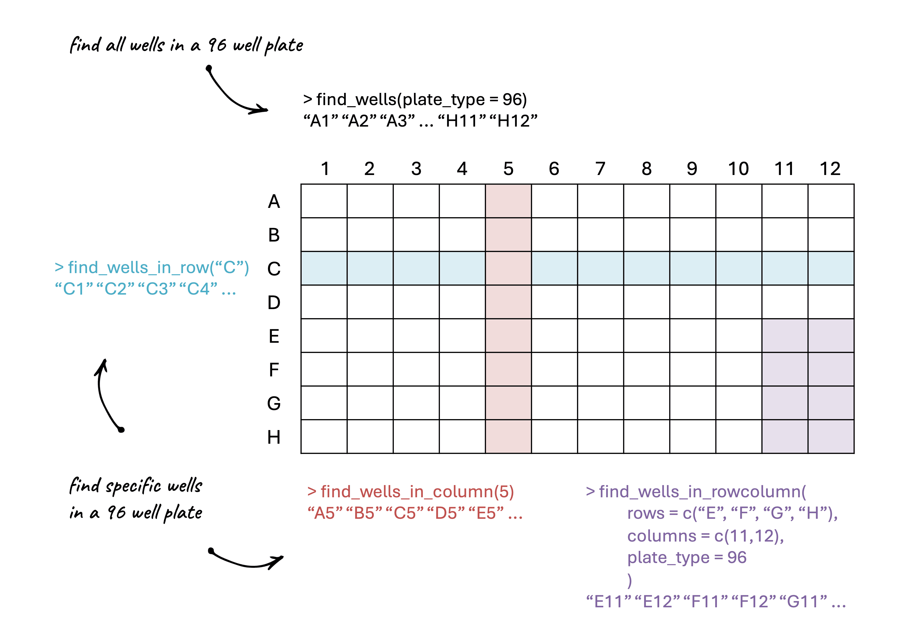

<style type="text/css">
code.r{ /* Code block */
    font-size: 11px;
}
pre { /* Code block - determines code spacing between lines */
    font-size: 13px;
}
</style>

```{r, setup, include=FALSE}
knitr::opts_chunk$set(eval = FALSE)
knitr::opts_chunk$set(echo = TRUE)
```

Functions like `find_wells_in_row()`, `find_wells_in_column()`, and `find_wells_in_rowcolumn()` are helper functions that can be useful for avoiding manually writing out lists of wells when processing experimental data.

<p align="center">
  
</p>

```{r, eval=TRUE}
library(fpcountr)
```

```{r, eval=TRUE}
find_wells_in_row(rows = c("A", "D"), plate_type = 96)
```

```{r, eval=TRUE}
find_wells_in_column(columns = c(1,2), plate_type = 24)
```

```{r, eval=TRUE}
find_wells_in_rowcolumn(rows = c("A", "B"), columns = c(1, 11,12), plate_type = 96)
```

There is also `find_wells()` which lets you print _all_ of the wells in a given plate type.

```{r, eval=TRUE}
find_wells(plate_type = 96)
```
```{r, eval=TRUE}
find_wells(plate_type = 24)
```

The most common use case for these functions is when you use `process_plate()` to process data from a plate experiment. Say you have your blank wells in column 11, and your negative wells in rows G-H, columns 1-4:

```{r, eval=FALSE}
processed_data <- process_plate(
  data_csv = "data/example_experiment_parsed.csv",
  blank_well = find_wells_in_column(11),
  od_name = "OD700",
  flu_channels = c("blue"),
  af_model = "spline",
  neg_well = find_wells_in_rowcolumn(rows = c("G", "H"), columns = c(1,2,3,4)),
  outfolder = "experiment_analysis"
)
```

Similarly, in `calc_fppercell()` when you are given the option to remove wells unneeded in the analysis, such as those that contain media or that were empty, you can use these functions to save a lot of typing.

```{r, eval=FALSE}
pc_data_mTagBFP2 <- calc_fppercell(
  data_csv = "experiment_analysis/example_experiment_parsed_processed.csv",
  flu_channels = c("blue"),
  flu_labels = c("mTagBFP2"),
  remove_wells = c(find_wells_in_column(11), # media
                   find_wells_in_column(c(1,12)) # empty wells
  ),
  outfolder = "experiment_analysis"
)
```
